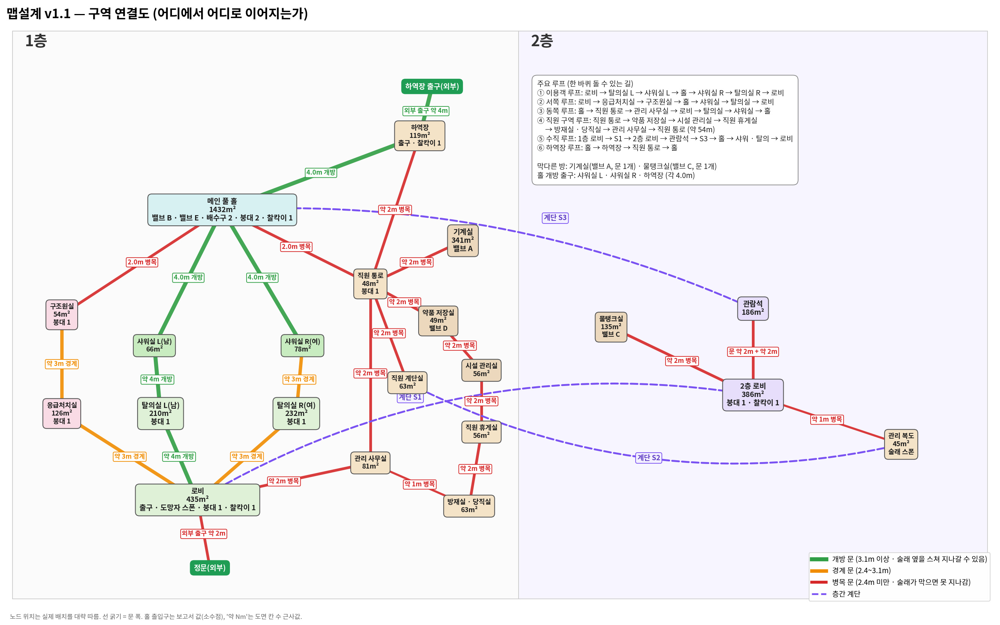

# 맵 설계 — 심야 실내수영장 전면 재설계안

| 항목 | 내용 |
|---|---|
| 버전 | **v1.1** (2026-10-05 — 검토 반영) · v1.0(2026-10-05, 커밋 8fafe77) |
| 상태 | **v1.1 확정 — 기획서 §10에 반영됨**(`docs/마르코_상세기획서.md` v0.6, 2026-10-05). **이 문서는 좌표 · 도면 정본**이다 |
| 용도 | 팀원이 블록아웃할 기준. **좌표 정본은 5 · 7 · 9절 표다.** 6절 도면은 1m 해상도로 그린 보조 자료다 |
| 범위 | 심야 실내수영장 맵 1개. 폐극장(§11 결번)은 범위 밖이다. 새 게임 시스템은 만들지 않는다. 규칙 수치는 기획서 본문 · 부록 A에서 읽었고, 기획서에 없던 규칙은 13절의 '설계안 결정'(검토자 결정)을 따랐다 |
| 검증 | 0.5m 격자 경로 탐색 · 차폐 계산(레포 밖 임시 스크립트, 커밋 안 함). 결과 수치만 싣는다. 판정은 블록아웃 후 **맵 지표 검증**으로 다시 한다(기획서 §10.2-1) |

### 정본 분담(기획서 v0.6)

| 내용 | 정본 | 다른 곳에서는 |
|---|---|---|
| 맵의 규칙 · 구조 · 구역 · 연결 · 오브젝트 배치 이유 · 지표 기준 | **기획서 §10** | 이 문서는 기획서 §10을 참조 |
| 좌표 · 치수 · ASCII 도면 · 문 목록 · 계산 결과 | **이 문서** | 기획서 §10은 이 문서의 절을 참조하고 좌표를 옮겨 적지 않는다 |
| 수치 상수(속도 · 반경 · 거리 기준 등) | **기획서 부록 A** | 본문은 부록 A를 참조 |

> **참조 주의.** 이 문서 안의 "현행" · "기획서 §10.x" 참조는 반영 전 기획서(v0.5)의 구 맵 절을 가리킨다(1 · 2 · 11 · 12절 등 설계 기록). v0.6 기획서 §10은 10.0 한눈에 보기 · 10.1 설계 원칙 · 10.2 규모와 지표(10.2-1 밸브 배치 제약) · 10.3 구역 · 10.4 연결 · 10.5 오브젝트 배치 · 10.6 동선 예시 · 10.7 물 · 10.8 도면과 좌표로 새로 쓰였다.

### v1.1 변경 요약

1. **동쪽 L자 공간 정리(1-1).**
   - v1.0의 '안내 · 사무 · 당직실'(OFF)은 장애물이 하나도 없어 도면에서 빈 L자로 보였다.
   - 이 공간을 **관리 사무실 · 방재실 · 직원 휴게실 · 시설 관리실** 4실로 나누고 가구를 놓았다(방법 (가)).
2. **관람석 하부(1-2).**
   - v1.0은 홀의 일부인 '관람석 아래 장비 구역'으로, 홀 쪽 12m가 통째로 열려 있었다.
   - v1.1은 **공조 덕트 공간**(보행 불가)으로 닫았다. 장비는 데크로 옮겨 엄폐물로 쓴다.
3. **홀 엄폐물(1-3).** 데크 어디서든 엄폐물까지의 최대 거리가 27.8m에서 **6.6m**가 됐다(기준 7.5m).
4. **2층 관람 로비(1-4).** 관람객 · 학부모 대기 공간으로 정하고 가구를 놓았다. 엄폐물까지 최대 24.5m에서 **6.0m**가 됐다. 크기는 유지했다.
5. **홀 개방 출구(1-5).**
   - 개방 등급 출구가 0곳에서 **3곳**이 됐다. 남 · 여 샤워실 개구부 4.0m, 하역장 장비 반입문 4.0m다.
   - 참고로 v1.0의 샤워실 출입구는 2.5m라 '경계' 등급이었고, 개방 등급 출구는 없었다.
6. **`@` = 배수구(1-6).** 기획서대로 2개를 유지한다.
7. **미결 17건 결정 반영(13절).** ①(수면 이동 3.0 m/s)과 ⑪(수면 이동 소리 6m)을 적용해 지표를 다시 계산했다.
8. **검증 중 발견해 고친 것.**
   - 직원 계단 S2가 계단실 한가운데 떠 있어 둘레 약 20m의 짧은 루프가 있었다(v1.0부터).
   - v1.0 표의 1.5 · 2.5 · 1.8 · 1.2m 문은 계산 엔진에서 0.5 격자로 반올림돼 1.0~3.0m로 계산됐다. v1.1은 모든 문 · 장애물 모서리를 0.5 격자에 맞춰 **표의 값 = 계산 값**이 되게 했다.
9. **차폐 대상 변경(⑤).**
   - 가구 · 설비 · 칸막이 · 기둥은 소리를 막지 않는다. 락커만 §5.6의 `Wall` 그대로 막는다.
   - v1.0은 높이 1.8 이상인 장애물을 벽 1장으로 셌다.
10. **붕대 후보 정리.** 후보 b5를 홀에서 직원 통로(SC)로 옮겼다. 홀 3곳이 기획서 §7 · 부록 A의 "같은 구역 최대 2곳" 규칙에 어긋났기 때문이다(9.1).

---

## 0. 팀원용 요약

**무엇이 바뀌나.** 현행 맵(52 × 40m L자, 보행 2,055m²)을 조금씩 고치지 않고 백지에서 다시 배치했다. 실제 25m 공공 수영장의 **세 동선**을 뼈대로 썼다.

| 동선 | 경로 | 바닥 |
|---|---|---|
| 이용객 | 출구 2(정문) → 로비 → 남 · 여 탈의실 → 샤워실 → 데크 | 카펫 → 매트 → 타일 |
| 관람객 | 로비 → 주계단 S1 → 2층 관람 로비 → 관람석(경영풀 남측 장변, 계단식) → 비상계단 S3 → 데크 | 카펫 → 그레이팅 |
| 직원 | 출구 1(직원 출입구 · 하역 셔터) → 하역장 → 직원 통로 → 기계실 · 약품 저장실 · 직원 계단 · 홀 비상문, 로비 쪽은 관리 사무실 → 방재실 → 휴게실 → 시설 관리실 → 약품 저장실 | 콘크리트 → 그레이팅 · 카펫 |

**한눈에.**

| 항목 | 현행 | 새 맵 v1.1 |
|---|---|---|
| 외곽 | 52 × 40m L자(1층 1,936m²) | **64 × 62m 직사각**(1층 3,968m²) + 2층 일부(바닥 +3.5) |
| 구역 | 13 + 구역 밖 바닥 1,142m² | **21**(1층 17 · 2층 4), 구역 밖 바닥 0 |
| 총 보행 면적(수면 포함) | 2,055.0m² | **3,960.8m²**(1.9배) |
| 홀 | 240.0m², 풀 14 × 8 | **1,468.0m²**, 경영풀 25 × 21 + 교습풀 12 × 8, 천장 9.0 |
| 관람석 | 2층, 풀 수면 위 56.0m² | 2층 남측 장변, **앞 난간이 수면에서 3.0m 뒤** |
| 막다른 구역 | 1층 6 + 2층 2 | **2**(기계실 A · 물탱크실 C — 둘 다 밸브 리스크로 의도) |
| 밸브 배치 §10.2-1 ② | 10/10 합격 | **10/10 합격**(0.5m 격자 최소 여유 1.9m) |
| 고함 커버리지 단순 → 차폐 반영 평균 | 74.0% → 14.8% | 38.4% → **10.9%**(홀 19.9%) |
| 술래 횡단(① 적용) | 11.7~12.1초 | **16.9~17.5초**(하한 15초 — ② 합격) |
| 엄폐물까지 최대 거리 | — | 홀 데크 **6.6m** · 2층 로비 **6.0m**(기준 7.5) |
| 홀 출입구 | — | 6곳 — 개방 3(남 2 · 동 1) · 병목 3 |

**블록아웃 규칙.**
- 좌표는 m 단위이고, 원점은 남서 모서리, +x는 동 · +y는 북이다. 2층 바닥은 Y +3.5다(§10.1 좌표계 그대로).
- **모든 구역 · 문 · 장애물 모서리는 0.5m 격자 위**에 있다.
- 표의 좌표는 **벽 중심선**이며 내벽 두께는 0.2다.
- 외벽은 외곽선 (0, 0)–(64, 62) **바깥쪽으로** 0.3 두께를 준다. 내부 좌표는 바뀌지 않는다.
- 장애물은 두 가지다.
  - 락커: §5.6 `Wall`이라 소리와 태그를 막는다.
  - 나머지 가구 · 설비 · 기둥: 이동만 막는다(⑤).
  - 차폐 기준은 기획서 §5.6과 일치한다(구조물 = `#` · `&`). 10절 계산값은 그대로 유효하다.

**남은 미결.** 기획서 v0.6 반영으로 정리했다(13.2). ⑦ 풀 수심은 기획서 부록 A [맵]에 확정, 락커 · 가구 차폐는 기획서 §5.6과 일치(구조물 = `#` · `&`), ⑬ 스태미나 회복은 기획서 이동 규칙(부록 A [이동속도])에서 결정. 남은 미결은 없다.

---

## 1. 현행 맵 진단

### 1.1 문제 6개 — 측정값

| # | 문제 | 현행 측정 | 원인 | 새 설계의 답 |
|---|---|---|---|---|
| 1 | 실제 수영장 같지 않음 | 라커룸 → 메인 풀 홀 서문 **7.7m 직행**. 샤워장은 라커룸 문에서 26.4m 떨어진 별실이고 출입구가 1개. 풀 14 × 8m. 유아풀이 홀 밖 별실. 사우나 · 세탁실 같은 부속실이 동선과 무관하게 흩어져 있다 | 구역을 기능 순서가 아니라 밸브 배치 검증에 맞춰 놓았다 | 세 동선(0절)을 뼈대로 백지에서 배치했다. 탈의 → 샤워 → 데크는 반드시 거친다(3절) |
| 2 | 정사각 방 + 입구 1개 | 출입구 1개짜리 방이 1층 6곳(약품창고 · 세탁실 · 라이프가드실 · 사우나 · 샤워장 · 기계실)과 2층 2곳(물탱크실 · 관람석) | 복도 바닥 위에 사각 방을 박아 넣었다 | 출입구 1개짜리는 A · C 둘뿐이다. 나머지 19구역은 문 2개 이상이거나 문 + 계단이다(8.4) |
| 3 | 외벽과 방 사이 쓸데없는 통로 | 구역 밖 바닥 **1,142.0m² = 1층의 59.0%**. 서쪽 외벽을 따라 2m 띠 80.0m², 남쪽 외벽을 따라 1m 띠 52.0m² | 방과 방 사이 빈 곳을 '복도'로 남겼다 | 바닥은 모두 어느 구역에 속한다. 통로는 직원 통로 하나뿐이고 이름과 용도가 있다. v1.0의 동쪽 빈 L자도 방 4개로 나눴다(v1.1, 1-1) |
| 4 | 관람석이 풀 바로 위 | 관람석 (18, 15)–(36, 21) 2층이 메인 풀 수면 (21, 17)–(35, 25) 위 **56.0m²**에 걸친다 | 홀 안에 2층을 겹쳐 놓았다 | 경영풀 남측 장변 뒤로 물린 계단식 관람석. 앞 난간 y 34.0, 수면 y 37.0 |
| 5 | 홀이 작음 | 메인 풀 홀 **240.0m²**(20 × 12), 수면 112.0m² | — | 홀 1,468.0m², 수면 621.0m², 천장 9.0 |
| 6 | 맵이 좁음 | 보행 **2,055.0m²**, 단순 고함 커버리지 74.0%, 술래 횡단 11.7~12.1초(63.1m) | — | 보행 3,960.8m², 38.4%, 16.9~17.5초(91.1m) |
| + | 질주 1회보다 짧은 루프 | 기획서 §10.3 L4 서비스 순환 **약 20m** < 37.5m | 서비스 구역의 작은 고리 | 문 · 계단마다 잰 최단 루프가 모두 42.1m 이상(8.2) |
| + | 30m 미만 밸브 쌍 | C↔D 21.8m(§10.2 정본) — '주의' | 물탱크실이 라커룸 위에 얹혀 있고 D가 가깝다 | 30m 미만 쌍 없음(최소 A↔D 30.3m) |

### 1.2 현행 측정 표

같은 엔진(10.1)으로 잰 값이다. 밸브 쌍 경로는 기획서 §10.2 표(정본 툴)가 따로 있으므로 엔진 값은 교차 검증에만 썼다(10.1).

| 지표 | 현행 값 |
|---|---|
| 외곽 · 층 | 52 × 40m L자(x ≥ 40 · y ≥ 28 컷), 1층 1,936.0m² + 2층(관람석 · 물탱크실 · 동 계단 상단) |
| 총 보행 면적 | 2,055.0m²(1층 1,916.5 + 2층 138.5, 수면 166.0 포함) |
| 구역 밖 바닥 | 1,142.0m²(1층의 59.0%) |
| 홀 · 수면 | 240.0m² · 112.0m² + 유아풀 54.0m² |
| 단순 고함 커버리지 | π × 22² ÷ 2,055.0 = 74.0% |
| 차폐 반영 고함 커버리지 | 평균 14.8%, 최대 29.8%(구역 밖 바닥) — 발생점 476개 |
| 술래 횡단 | 63.1m(밸브 A ↔ 출구 2 정문) → 11.7~12.1초 |
| 도망자 1인당 면적 | 5명 411.0 · 2명 1,027.5m² |
| 밸브 경로(§10.2 정본) | 21.8~60.1m, 30m 미만 1쌍(C↔D) |
| §10.2-1 ② | 10/10 합격 |
| 라운드 대비 이동 | 혼자 활성 3개 + 출구: 123.9~135.7m = 48.8~51.1초(10분의 8~9%) |

### 1.3 현행 도면(진단용, 1칸 = 1m)

```
      0         1         2         3         4         5  
      01234567890123456789012345678901234567890123456789012
     #######+X#################################            
 39  #..#.........#...........................#            
 38  #..#.........#...######....#######.......#            
 37  #..#.........#...#.....#...#......#......#            
 36  #..#.........+...#..D..#...#......#......#            
 35  #..#.........+...+.....#...#......#......#            
 34  #..#....R....#...+.....#...#......#......#            
 33  #..#.........#...#######...##++####......#            
 32  #..####++#####...........................#            
 31  #..############..........................#            
 30  #..#...........#.........................#            
 29  #..#...........#.........................#            
 28  #..#.......////#.........................#############
 27  #..#.......////+...###############++###..............#
 26  #..#...........+...#...................#.............#
 25  #..#...........#...#...................#.............#
 24  #..#####++######...#..~~~~~~~~~~~~~~...+.............#
 23  #..................#..~~~~~~~~~~~~~~...+.............#
 22  #..................#..~~~~~~~~~~~~~B///#.............#
 21  #..#####...........#..~~~~~~~~~~@~~~///#.............#
 20  #..#....#..........+..~~~~~~~~~~~~~~///#.............#
 19  #..#....+..........+..~~~~~~~~~~~~~~///#.&...........#
 18  #..#....+..........#..~~~~~~~~~~~~~~///#.&...........#
 17  #..######..........#..~~~~~~~~~~~~~~...#.&...........#
 16  #..................#...................#.&...........#
 15  #..................#####################.&...........#
 14  #..#####++#####..........................&...........#
 13  #..#...........#...#++#..................&...........#
 12  #..#~~~~~~~~~~.#...#...#...###++###.......########...#
 11  #..#~~~~~~~~~~.#...#...#...#.......#......#.......#..#
 10  #..#~~~~~~~~~~.+...#...#...#.......#......#.......#..#
  9  #..#~~E~~@~~~~.+...#####...#.......#......#.......#..#
  8  #..#~~~~~~~~~~.#...........#.......#......#....A..#..#
  7  #..#~~~~~~~~~~.#...........#########......#.......#..#
  6  #..#~~~~~~~~~~.#..........................#.......#..#
  5  #..#############..........................###++####..#
  4  #.............++..............++............++.......#
  3  #..............+.................................#...#
  2  #..............+.............................S.X.#...#
  1  #..............###################################...#
  0  #....................................................#
     ##############################################++######
```

2층(y 12~30만):

```
      0         1         2         3         4         5  
      01234567890123456789012345678901234567890123456789012
 30                                                        
 29      ########                                          
 28      #......#///                                       
 27      #......#///                                       
 26      #...C..#                                          
 25      #......#                                          
 24      #......#                                          
 23      ########                                          
 22                                      ///               
 21                    ###################//               
 20                    #................./#/               
 19                    #................./#/               
 18                    #................./###              
 17                    #..................+.#              
 16                    #..................###              
 15                    #..................#                
 14                    ####################                
 13                                                        
 12                                                        
```

**범례(현행 도면).**

| 기호 | 뜻 |
|---|---|
| `#` | 벽 |
| `.` | 걸을 수 있는 바닥(구역 밖 '복도' 바닥 포함) |
| `~` | 물(수면) |
| `+` | 문 · 개구부(외벽의 `+`는 외부 출구 문) |
| `/` | 계단 |
| `&` | 기계실–풀 홀 칸막이(x 40, y 13~20) |
| `A`~`E` | 밸브 |
| `@` | 배수구 |
| `X` | 출구 판정점 |
| `R` · `S` | 도망자 스폰 · 술래 격리 지점 |
| 빈칸 | 맵 밖(1층) · 바닥 없음(2층) |
| 위 두 줄 · 왼쪽 숫자 | x 눈금(십의 자리 / 일의 자리) · y 눈금 |

---

## 2. 설계 입력값

### 2.1 기획서 수치

| 항목 | 값 | 출처 | 이 문서에서 쓴 곳 |
|---|---|---|---|
| 좌표계 | 원점 남서, +x 동, +y 북, m. 2층 바닥 Y +3.5 | §10.1 | 전체 |
| 태그 판정 | 반경 1.2m, 전방 ±45°(수평) | §3.1-2 · 부록 A [태그 판정] | 통로 폭 등급(4.3), 얇은 엄폐물 기준(8.3) |
| 몸통 반경 | 0.35m | §4.2 · §10.2 | 통로 폭 등급, 장애물 틈 |
| 도망자 속도 | 걷기 5.0 · 질주 7.5 m/s | §3.1 · §4.2 | 라운드 대비 이동, 루프 |
| 질주 1회 거리 | 7.5 × 5초 = **37.5m** | §3.1 · §10.2 | 짧은 루프 기준(8절) |
| 술래 속도 | 5.0 × 인원 보정: 3인 5.25 · 4인 5.20 · 5인 5.30 · 6인 5.40 m/s | §3.1 · §6.2 | 횡단 · 초 환산(기본 5.30) |
| 술래 잠행 | 3.5 m/s, 발소리 2m | §3.1 | 발소리 표(10.7) |
| 술래 발소리 | 상시 질주급 6m | §3.1 | 발소리 표 |
| 메아리 | 6.0 m/s, 충돌 없음(벽 통과) | §3.1 · §3.2 · 부록 A [메아리] | 13절 ⑫ |
| 소리 발생 반경 | 속삭임 4 · 대화 9 · 고함 22 · 걷기 2 · 질주 6 · 밸브 12 · 비명 · 노크 · 신음 · 동료 치료 9 · 붕대 6 | §5.1 | 커버리지 · 감시 · 차폐 예시 |
| 술래 청취 배율 | 반경 ×1.2 | §5.1 · §5.7 | 같음 |
| 차폐 | 벽 1장 ×0.5, 락커 `Wall`, 층간 바닥 ×0.25(벽 2장 상당), 수면 ×0.5, 계단은 개구부 | §5.6 · §10.1 · §10.2-1 | 모든 소리 계산 |
| 바닥재 배율 | 금속 그레이팅 ×1.5 · 타일 ×1.3 · 콘크리트 · 목재 ×1.0 · 매트 · 카펫 ×0.7, 물(수면 아래) 파문 없음 | §5.9 | 구역 바닥재. §5.9 표에 있는 구역 종류는 그 재질을 따랐다(라이프가드실 → 구조원실 카펫, 관람석 카펫, 계단 그레이팅) |
| 밸브 | 5개 배치, 활성 3(B · E 고정 + A · C · D 중 1), 요구 3, 총 점유 8.0초. A는 기계 앰비언스 ×0.5(발생 6m) | §6.1-0 · §6.1 | 9절 |
| 밸브 배치 판정 | ② 동시 감시 0개: 거리(P, 밸브) ≤ 14.4 × 0.5^벽 수가 두 밸브에 동시에 성립하는 P 없음. P = 지상 · 2층 · 경사로 | §10.2-1 | 10.3 |
| 경로 30m 미만 | '주의'(판정 아님) | §10.2-1 | 10.3 |
| 출구 | 2개, 판정 반경 2.0, 출구 1 = 시끄러운 쪽(현행 배수로) · 출구 2 = 정문 | §10.5 | 7 · 9절 |
| 배수구 | **2개소**(최후 생존자 페이즈 진입 시 무작위 1개 활성), 수심 3.5, **육상에서 3.0m 이상**, 얕은 풀은 침강부(반지름 1.2) | §6.5-2 · §6.5-3 · §10.1 · §10.5 | 9절, 1-6 |
| 풀 깊은 쪽 수심 | 메인 풀 깊은쪽 3.5m | §10.1 수면 영역 표 | 경영풀 x 34~40 |
| 붕대 | 라운드당 도망자 수 + 1개, 후보 지점 ≥ 6 | §7 | 9곳(9절) |
| 찰칵이 | 맵당 4곳 | §7 | 4곳(9절) |
| 인원 · 제한시간 | 3~6인(도망자 2~5명), 8 · 10 · 10 · 12분 | §6.2 | 1인당 면적, 라운드 대비 이동 |
| 계단 경사 | `slopeLimit` 45° 미만 | §10.1 | 계단 3개 모두 30.3° |
| 벽 | 두께 0.2(현행 정본 — 기획서 §10.1, GAP-77), 수면 4변 측벽 `Wall` | §10.1 | 내벽 0.2, 풀 측벽 유지 |

### 2.2 작업 지시 입력값(기획서에 없는 것)

- **v1.0 지시.**
  - 풀 규격: 경영풀 25 × 21, 교습풀 12 × 8.
  - 홀: 1,300m² 이상, 천장 7m 이상.
  - 관람석: 장변 2층 계단식(풀 위에 걸치지 않음).
  - 0.5m 격자, 내벽 0.2 · 외벽 0.3.
  - 막다른 구역 최대 2곳, 직선 25m 이하, 계단 2곳 이상.
  - 4절 출발 목표.
- **v1.1 검토 지시.**
  - 엄폐물: 데크 · 2층 로비 어디서든 **7.5m 이내**(질주 1초 거리).
  - 공간: 외벽을 따라 두 지점을 잇기만 하는 공간을 남기지 않는다. 방마다 출입구 2개 원칙.
  - 홀 출구: 하역장 쪽 문은 **개방 등급**, 개방 출구가 두 방향 이상. (지시는 3.2m 이상이었으나 기획서 v0.6이 개방 등급을 계산식 값 3.1m 이상으로 통일했다 — 4.3)

### 2.3 설계안 결정(v1.1 — 기획서 미반영, 13절)

기획서에 없던 규칙 중 이 맵의 계산에 들어간 것이다. 기획서에 반영할 때 손댈 곳은 12절에 있다.

| # | 결정 | 이 문서에서 쓴 곳 |
|---|---|---|
| ① | 수면 이동(헤엄) **3.0 m/s**(걷기의 60%), 모든 역할 같음 | 시간 최단 경로 · 횡단 · 라운드 대비 이동 · 루프 시간(10절) |
| ⑪ | 수면 이동 소리 = **질주 등급 파문 6m**(술래 청취 7.2) | 감시 표(10.6) · 발소리 표(10.7) |
| ④ | 태그는 **벽을 넘지 않는다** — 술래와 대상 사이에 `Wall`(벽 · 락커)이 있으면 실패 | 통로 폭 등급 해석(4.3) · 10.10 |
| ⑤ | 소리를 막는 것은 **벽 · 층간 바닥 · 수면 · HardBlocker**뿐(§5.6이 `Wall`로 정한 **락커 포함 — 락커는 가구가 아니다**). **가구**(의자 · 벤치 등 낮은 오브젝트)와 설비 · 칸막이 · 기둥은 소리와 태그를 막지 않는다 | 차폐 계산 전체, 9.3 '성질' 열 |
| ⑥ | 관람석 좌석 사이는 걷지 않는다 — 통로로만 | 관람석 형태(5절) |
| ⑦ | 풀 수심: 기획서 값(깊은 쪽 3.5 · 침강부 3.5), 나머지는 경영풀 **1.8** · 교습풀 **1.2**로 확정 | 5 · 9절 |
| ⑫ | 메아리 이동 범위: 건물 내부 전체, 천장 아래까지(홀 9.0) | 12절 |

### 2.4 코드 참고값(기획서에 없음 — 근거가 아니라 참고)

| 값 | 위치 | 쓴 곳 |
|---|---|---|
| 서 있을 때 눈높이 1.62 | `DiveRules.StandingHeadHeight` | 청자 높이 |
| 잠수 최소 수심 0.5, "서서 잠기는" 구간 0.5 < 수심 < 1.62(GAP-75) | `DiveRules.MinDivableDepth` | 교습풀 1.2는 이 구간 안 |
| 도망자 스폰 슬롯 4열 × 2행(열 2.1 · 행 1.5) | `MapSpawnSlots` | 로비 스폰 자리 |
| 스태미나 회복 초당 1초, 소진 페널티 중 회복 없음(프로토타입 코드 참고값. 확정 규칙은 기획서 부록 A [이동속도] (소진의 절반, 10초 회복), 차이 문서 15번 참조) | `SprintConfig.RecoveryPerSecond` | 13절 ⑬ — 확정 규칙은 소진의 절반(완전 회복 10초, 기획서 부록 A)이라 코드값(5초)과 다르다. 코드는 수정하지 않았다 |

### 2.5 기획서와 지시가 다른 값 — 보고

| 항목 | 기획서 | 지시 | 처리 |
|---|---|---|---|
| 벽 두께 | 0.2 하나(GAP-77) | 내벽 0.2 · 외벽 0.3 | 내벽은 같다. 기획서에 외벽 두께 구분이 없어 지시값 0.3을 **외곽선 바깥쪽으로** 적용했다. 내부 좌표 · 판정에는 영향이 없다 |
| 벽 높이 | 3.5(층 간격에서 유도, GAP-77) | 홀 천장 7m 이상 | 일반 3.5, 홀 9.0(⑭). 홀 · 기계실 · 하역장 · 로비는 천장(4.5~9.0)까지 벽을 올린다. 차폐 판정(벽 수)은 높이와 관계없이 계산했다 |
| 락커의 소리 차단 | §5.6 `Wall` | ⑤ "가구는 막지 않는다" | **확정** — 락커는 가구가 아니라 `Wall`이다. 소리와 태그를 막는다. 락커는 통과 · 진입 불가 고정 장애물이고 내부에 숨는 기능은 없다. 은신은 락커 줄 사이 통로에서 락커 벽으로 시선 · 소리 · 태그가 차단되는 것으로만 성립한다 |

---

## 3. 실제 수영장 참고 — 설계에 쓴 배치 관례

아래는 공공 실내수영장에서 흔히 쓰는 배치 원칙을 설계 판단의 근거로 정리한 것이다. 법규나 문헌을 인용한 것이 아니며, 수치는 2.2 지시값만 썼다.

1. **이용객은 한 방향 직렬로 움직인다.**
   - 동선: 로비(신발을 벗는 곳) → 성별 탈의실 → 샤워실 → 데크. 탈의실에서 데크로 바로 나가는 문은 없다.
   - 적용: ML · WL은 데크와 문을 공유하지 않고, 샤워실 MS · WS를 반드시 지난다.
2. **탈의실은 데크에서 들여다보이지 않는다.** 출입구를 엇갈리거나 칸막이를 둔다.
   - 적용: 샤워실의 탈의실 쪽 · 데크 쪽 개구부를 1.0m 띄워 엇갈렸다(d07 · d08, d10 · d11).
3. **관람객은 맨발 구역에 들어오지 않는다.** 신발을 신은 채 계단으로 2층 관람석에 오르고, 관람석은 풀 장변을 따라 계단식이다.
   - 적용: 로비 주계단 S1 → 관람 로비 → 관람석. 데크로 내려가는 길은 비상계단 S3 하나다.
   - 2층 로비는 강습 시간에 보호자가 기다리는 대기 공간을 겸한다.
4. **직원 · 설비 동선은 이용객 동선과 겹치지 않는다.** 약품 · 장비 반입은 별도 출입구를 쓴다. 기계실(여과 · 펌프)은 배관이 짧도록 풀 옆에 두고, 약품은 별실에 둔다.
   - 적용: 하역장 · 직원 통로 · 기계실 · 약품 저장실을 동쪽 한 줄에 모았다.
5. **직원 사무 구역은 안내데스크 뒤에 붙는다.** 행정 사무실 · 방재실(CCTV · 소방 수신반 · 방송) · 휴게실 · 시설 관리실이 나란히 있고, 시설 관리실은 약품 · 설비실 가까이 둔다.
   - 적용: 동쪽 4실(OF1~OF4)을 사무실 → 방재실 → 휴게실 → 시설 관리실 → 약품 저장실 순으로 이었다.
6. **구조원실은 데크에 바로 면하고, 응급처치실은 데크와 외부 사이에 둔다.** 들것이 꺾이지 않고 나가야 한다.
   - 적용: 구조원실 LG → 응급처치실 FA → 로비가 x 4.5 한 축의 양개문(d05 · d04 · d03)으로 이어지고, 로비를 가로질러 정문으로 나간다.
7. **물탱크는 위층에 둔다.**
   - 적용: 물탱크실 C는 2층이다.
8. **교습풀(얕은 풀)은 경영풀과 같은 홀에 둔다.** 구조원 한 자리에서 두 풀을 다 본다.
   - 적용: 교습풀 P2를 홀 서쪽, 경영풀 P1을 홀 동쪽에 두었다. 깊은 쪽(x ≥ 34)은 동쪽이고 출발대 · 1m 스프링보드도 그쪽에 있다.
9. **관람석 아래 빈 공간은 설비 경로로 쓴다.** 실내 수영장은 습기 때문에 제습 공조 덕트가 크다.
   - 적용: 관람석 하부 (21, 24)–(33, 31)을 공조 덕트 공간으로 닫았다(1-2).
10. **데크에는 풀 비품이 놓인다.**
    - 비품: 출발대(깊은 쪽 끝), 레인 로프 릴(풀 끝), 킥판 · 풀부이 거치대, 구조원 감시 의자(풀 장변 · 풀 사이), 입수 사다리 · 계단 손잡이, 구조 장비 스탠드(구명환 · 레스큐 튜브), 벽면 벤치.
    - 적용: 이것들로 데크 엄폐물을 만들었다(1-3).

---

## 4. 목표 수치

### 4.1 목표와 결과

| 지표 | 정의 | 목표 | 현행 | 새 맵 v1.1 | 판정 |
|---|---|---|---|---|---|
| 고함 커버리지(단순) | π × 22² ÷ 총 보행 면적 | (v1.0에서 교체) | 74.0% | 38.4% | 기록 |
| 고함 커버리지(차폐 반영) | 보행 바닥 2m 격자 발생점마다 고함 22m가 닿는 보행 면적 비율(벽 ×0.5 · 층간 바닥 ×0.25)의 평균 | 맵 평균 10~20%, 홀 평균 20% 안팎 · 최대 30% 이하 | 평균 14.8% · 최대 29.8% | 평균 **10.9%** · 홀 평균 19.9% · 최대 28.1% | 합격 |
| 총 보행 면적 | 1 · 2층 걸을 수 있는 바닥 + 수면 | 현재 규모 유지(③) | 2,055.0 | **3,960.8** | 합격 — 외곽 · 구역 규모 그대로, v1.0 대비 −130.4는 관람석 하부 폐쇄와 가구(4.2) |
| 홀 면적 | 구역 H | 1,300m² 이상 | 240.0 | **1,468.0** | 합격 |
| 술래 횡단 | 스폰 · 밸브 · 출구 9점 쌍 중 최장 '시간 최단 경로'(데크 술래 속도 · 수면 3.0) | **15~25초**(②) | 11.7~12.1초 | **16.9~17.5초** | 합격 |
| 엄폐물까지 최대 거리 | 데크 · 2층 로비 칸에서 가장 가까운 엄폐물 면까지 데크 경로 | **7.5m 이하** | — | 홀 **6.58m** · 2층 로비 **5.99m** | 합격 |
| 홀 개방 출구 | 폭 ≥ 3.1(개방 등급) | 두 방향 이상 | — | 남 2 · 동 1 | 합격 |
| 도망자 1인당 면적 | 총 보행 ÷ 도망자 수 | — | 5명 411.0 · 2명 1,027.5 | 5명 **792.2** · 2명 1,980.4 | 기록 |
| 밸브 쌍 §10.2-1 ② | 동시 감시 지점 수 | 10쌍 모두 0 | 10/10 | **10/10**, 최소 여유 1.9m | 합격 |
| 밸브 쌍 경로 | 기록(데크 30m 미만 '주의') | — | 21.8~60.1m(정본), 주의 1쌍 | 데크 **30.3~80.6m**, 주의 0쌍 · 술래 5.7~15.2초 | 기록 |
| 짧은 루프 | 문 · 계단마다 잰 최단 루프 | 37.5m(질주 5초) 이상 | L4 약 20m | **42.1m**(수영 허용 5.62초) | 합격 |
| 라운드 대비 이동 | 혼자 활성 3개 + 출구까지(걷기 5.0 · 수면 3.0) + 회전 8.0 × 3 | — | 48.8~51.1초(10분의 8~9%) | **54.1~59.6초**(10분의 9~10%) | 기록 — 이동이 시간을 지배하지 않는다 |

### 4.2 목표를 정한 근거

**① 고함 커버리지 — 단순식을 차폐 반영식으로 교체(v1.0).**
- 출발 목표 20~30%의 뜻은 "고함 한 번이 맵의 1/5~1/3에 닿는다"이다. 그런데 단순식 π × 22² ÷ 면적은 벽을 무시한다.
- 현행 맵에서 두 값을 같이 재면 단순 74.0%, 차폐 반영 14.8%로 **5배 차이**가 난다. 벽이 촘촘한 맵일수록 단순식은 실제보다 크게 나온다.
- 차폐 반영으로 재면 홀(개활 공간)은 평균 19.9% · 최대 28.1%로 출발 목표 범위에 든다. 방 안에서는 2.9~11.0%로 떨어진다(10.4 표).
- "열린 홀에서 지르면 맵의 1/5이 듣고, 방에 숨어서 지르면 거의 안 들린다"는 차이가 이 맵이 만들려는 위험 지도다.

**② 술래 횡단 — 하한 15초(검토 결정 ②).**
- 18초는 출발점이었다. ①(수면 3.0)을 적용해 시간 최단 경로로 다시 재면 16.9~17.5초다. 최장 쌍(C ↔ 출구 1)은 헤엄을 쓰지 않는다.
- 이 엔진은 몸통 반경을 넣지 않아 정본 툴보다 2.5~5.8% 짧게 나온다(10.1). 그러니 정본으로 재면 이보다 길다.

**③ 크기 — 현재 규모 유지(검토 결정 ③).**
- 1인당 면적이 이미 현행의 1.9배이고, v0.5 체력 2단계로 술래가 불리해져 있다.
- v1.0 대비 보행 면적은 130.4m² 줄었는데, 외곽이나 구역을 줄인 결과가 아니다. 세 가지에서 나왔다.
  - 관람석 하부 장비 구역 폐쇄(1-2)
  - 동쪽 직원 구역과 2층 로비의 가구(1-1 · 1-4)
  - 데크 엄폐물(1-3)
- 보행 면적의 출발 목표(5,000~7,500)는 ①의 단순식을 면적으로 뒤집은 값(π × 22² ÷ 0.30 = 5,068)이었다. ①을 교체하면서 근거가 사라졌다.

### 4.3 통로 폭 등급(태그 반경 + 몸통 반경)

술래가 통로 가운데 서 있을 때, 지나가는 도망자의 중심은 벽에서 0.35 이상 떨어진다. 그래서 술래에서 도망자까지 가장 먼 거리는 `폭 ÷ 2 − 0.35`다.

| 등급 | 폭 | 뜻 |
|---|---|---|
| **병목** | < 2.4 | `폭 ÷ 2 ≤ 1.2` — 술래가 가운데에서 몸통 반경(0.35)만큼 비켜서도 폭 전체가 태그 범위다. 사실상 봉쇄 |
| **경계** | 2.4~3.1 | `폭 ÷ 2 − 0.35 ≤ 1.2` — 술래가 정확히 가운데 서야 막힌다 |
| **개방** | ≥ 3.1 | 가운데 선 술래 옆으로도 빠져나갈 수 있다(전방 ±45° 조건은 별도). v1.1의 새 개방 문은 모두 4.0 |

**④(태그 벽 차단)을 적용해도 등급은 바뀌지 않는다.** 등급은 문 한가운데에 선 술래를 기준으로 했고, 그 술래와 도망자 사이에는 벽이 없기 때문이다. 바뀌는 것은 두 가지다.
- **문 옆 매복이 약해진다.** 문틀 옆 벽에 붙어 선 술래는 이제 문틀 너머로 태그할 수 없다. 개구부 폭 안에 들어온 도망자만 잡는다.
- **벽 너머 태그가 사라진다.** 벽 하나를 사이에 두고 양쪽이 모두 보행 칸인 경계가 199.5m 있다(10.10). 이 경계에서 벽 너머로 하던 태그가 없어진다. 대표 구간은 직원 통로 ↔ 홀 동측 데크(19.0m)다.

### 4.4 직선 25m 규칙 — 적용 범위(⑯)

이 문서는 규칙을 **폭 4m 미만 통로형 공간의 끊김 없는 직선 길이 ≤ 25m**로 읽었다.
- 대상: 직원 통로 · 관람석 통로 · 관리 복도 · 데크의 좁은 구간.
- 제외: 홀 · 로비 · 관람 로비. 폭 4m 이상이고 사방으로 돌아갈 수 있는 방이라 대상에서 뺐다.
- 직원 통로는 y 31~33에서 꺾어 24.0m와 23.0m로 나눴다. 검토에서 이 처리를 인정했다(⑯). 꺾인 지점에서 시야와 파문 직선이 벽에 끊기기 때문이다.

점검 결과는 8.6에 있다.

---

## 5. 구역 목록

- 좌표는 벽 중심선이다. `∪`는 여러 사각형을 합친 구역이다.
- 면적은 **바닥 / 보행**(m²)이다. 보행 = 바닥 − 장애물 − 계단 구멍 + 수면.
- 출입구 = 문 수 · 계단 접속 수 · 외부 출구.
- 천장고는 바닥에서 잰 값이다. 2층 아래 방은 3.0(2층 바닥 Y 3.5 − 슬래브 · 천장 설비 0.5)이다.
- **풀 수심(⑦)**:
  - 경영풀: 1.8, 깊은 쪽 x 34~40은 3.5(기획서 §10.1 '깊은쪽 3.5m' — 밸브 B · 배수구 1).
  - 교습풀: 1.2, 배수구 2 침강부는 3.5 · 반지름 1.2(기획서).
  - 1.8 · 1.2는 기획서 v0.6 부록 A [맵]에 확정값으로 들어갔다. 분포는 아래 "수심 분포".

**수심 분포**(10-06 확정 — 수심 값의 정본은 기획서 부록 A [맵], 좌표는 이 표)

| 구간 | 좌표(m) | 수심 | 비고 |
|---|---|---|---|
| 경영풀 | (15.0, 37.0)–(40.0, 58.0) | 1.8 | 25 × 21 |
| 경영풀 깊은 쪽 | (34.0, 37.0)–(40.0, 58.0) | 3.5 | 풀의 동쪽 끝 6m 구간(기획서 §10.7). 출발대 · 스프링보드 쪽. 밸브 B · 배수구 1이 여기 있다 |
| 교습풀 | (3.0, 41.0)–(11.0, 53.0) | 1.2 | 8 × 12 |
| 배수구 2 침강부 | 중심 (7.0, 47.0), 반지름 1.2 — 둘레 사각 범위 (5.8, 45.8)–(8.2, 48.2) | 3.5 | 기획서의 반지름 1.2m 정의를 그대로 쓴다(원형이라 0.5 격자에 맞지 않는다) |

대치 조건 검증(기획서 §6.5-3 — 거리는 **배수구 중심에서 가장 가까운 물가까지**. 도망자가 떠오르는 지점이 배수구이기 때문이다)

| 배수구 | 중심 | 가장 가까운 물가 | 물가 거리 | 기준 | 수심 | 판정 |
|---|---|---|---|---|---|---|
| 배수구 1(경영풀) | (36.0, 47.5) | 동쪽 x 40.0 | 40.0 − 36.0 = **4.0m** | ≥ 3.0 | 3.5(깊은 쪽) | 합격 |
| 배수구 2(교습풀) | (7.0, 47.0) | 서쪽 x 3.0 · 동쪽 x 11.0 | 7.0 − 3.0 = 11.0 − 7.0 = **4.0m** | ≥ 3.0, 상한 4.0(폭 8의 절반) | 3.5(침강부) | 합격 |

| ID | 이름 | 층 | 좌표(m) | 면적(m², 바닥 / 보행) | 바닥재 | 천장고(m) | 출입구 | 랜드마크 | 왜 거기 |
|---|---|---|---|---|---|---|---|---|---|
| LOB | 로비 · 안내데스크 | 1 | (0.0, 0.0)–(46.0, 9.0) ∪ (25.0, 9.0)–(29.0, 16.0) | 442.0 / 380.5 | 카펫 | 4.5 | 문 4 · 계단 1 · 외부 출구 2(정문) | 정문 자동 양개문 · 동쪽 끝 안내데스크(8.0m) · 북벽 신발장 4열 · 서쪽 자판기 열 · 매점 카운터 | 이용객 · 관람객 동선의 출발점. 건물 남측 전면을 띠로 써서 남 · 여 탈의실 입구, 응급처치실, 주계단, 관리 사무실이 모두 로비에서 갈라진다. 도망자 스폰 · 출구 2(정문) |
| OF1 | 관리 사무실 | 1 | (46.0, 0.0)–(56.0, 9.0) | 90.0 / 80.0 | 카펫 | 3.0 | 문 3 | 벽 붙임 사무 책상 열 · 서류 캐비닛 · 안내데스크 뒤 직원문 | 안내데스크 바로 뒤에서 접수 · 매표를 돕고 로비를 보는 행정 사무실. 직원 통로 입구(d12)를 관리한다. 문 3(로비 · 직원 통로 · 방재실) |
| OF2 | 방재실 · 당직실 | 1 | (56.0, 0.0)–(64.0, 9.0) | 72.0 / 65.0 | 카펫 | 3.0 | 문 2 | 방재 콘솔(CCTV · 방송 · 소방 수신반) · 당직 침대 | 건물 남동 모서리. 정문과 하역장 양쪽 CCTV · 방송 · 소방 수신반을 보는 자리이자 야간 당직실. 사무실 바로 옆에 둔다. 문 2(사무실 · 휴게실) |
| OF3 | 직원 휴게실 | 1 | (56.0, 9.0)–(64.0, 18.0) | 72.0 / 65.0 | 카펫 | 3.0 | 문 2 | 간이 주방 · 냉장고 · 벽 붙임 식탁 | 사무 · 방재 근무자와 시설 직원이 함께 쓰는 휴게실 — 사무 구역과 설비 구역 사이에 둔다. 문 2(방재실 · 시설 관리실) |
| OF4 | 시설 관리실 | 1 | (56.0, 18.0)–(64.0, 27.0) | 72.0 / 66.0 | 콘크리트 | 3.0 | 문 2 | 작업대 · 공구 벽 · 직원 사물함 | 시설 관리 직원의 작업 거점. 약품 투입 · 설비 점검을 하므로 약품 저장실과 문(d20)으로 바로 잇는다(§6.1 D '통로 분기 2개'의 두 번째 문). 문 2(휴게실 · 약품 저장실) |
| FA | 응급처치실 | 1 | (0.0, 9.0)–(9.0, 24.0) | 135.0 / 135.0 | 타일 | 3.0 | 문 2 | 들것 · 산소통 선반 · 침대 2개 | 데크(구조원실)에서 로비 · 정문까지 들것이 꺾이지 않고 나가는 양개문 축(x 4.5 — d03 · d04 · d05) 가운데 |
| LG | 구조원실 | 1 | (0.0, 24.0)–(9.0, 31.0) | 63.0 / 63.0 | 카펫 | 3.0 | 문 2 | 데크 쪽 감시창(유리 — §10.4 '라이프가드실 유리창' 계승) · 구조 튜브 걸이 | 데크 서남 모서리에서 교습풀과 경영풀 얕은 쪽을 함께 내려다보는 자리. 응급처치실과 붙어 들것 축의 데크 쪽 끝 |
| ML | 남 탈의실 | 1 | (9.0, 9.0)–(25.0, 24.0) | 240.0 / 221.0 | 매트 | 3.0 | 문 2 | 벽 부착 락커 8열(빗살) · 가운데 6.5m 탈의 공간 | 로비 → 탈의 → 샤워 → 데크로 이어지는 남성 직렬 동선. 락커는 벽에 붙인 빗살형이라 락커 한 열을 도는 짧은 루프가 없다 |
| WL | 여 탈의실 | 1 | (29.0, 9.0)–(46.0, 24.0) | 255.0 / 235.0 | 매트 | 3.0 | 문 2 | 벽 부착 락커 8열(빗살) · 가운데 7.0m 탈의 공간 | 여성 직렬 동선(ML과 대칭). 락커 배치 원칙 같음 |
| MS | 남 샤워실 | 1 | (9.0, 24.0)–(21.0, 31.0) | 84.0 / 64.0 | 타일 | 3.0 | 문 2 | 양 벽 샤워 부스 열 | 탈의실과 데크 사이 필수 통과 공간. 탈의실 쪽 개구부(d07 x 11.5~14.5)와 데크 쪽 개구부(d08 x 15.5~19.5)를 1.0m 띄워 엇갈려 데크에서 탈의실이 정면으로 들여다보이지 않는다(10.8 ①) |
| WS | 여 샤워실 | 1 | (33.0, 24.0)–(46.0, 31.0) | 91.0 / 71.0 | 타일 | 3.0 | 문 2 | 양 벽 샤워 부스 열 | MS와 같은 역할. 데크 쪽 d11 x 34.0~38.0, 탈의실 쪽 d10 x 39.0~42.0으로 1.0m 띄워 엇갈림 |
| H | 메인 풀 홀 | 1 | (0.0, 31.0)–(46.0, 62.0) ∪ (46.0, 33.0)–(48.0, 54.0) | 1,468.0 / 1,428.8 (수면 621.0) | 타일 | 9.0 (관람석 아래 데크 띠 x 15~40 · y 31~34는 3.0) | 문 5 · 계단 1 | 경영풀 8레인 · 출발대 8개 · 1m 스프링보드 · 구조원 감시 의자 3개 · 레인 로프 릴 · 관람석 기둥 열(9.1 · 9.2) | 맵의 중심. 출입구 6곳(d05 · d08 · d11 · d17 · d21 · 계단 S3)이 남 · 동 · 서남에 흩어져 있고, 그중 개방 등급이 남쪽 2 · 동쪽 1이다. 수중 밸브 B · E와 배수구 2개가 모두 여기 있다 |
| SC | 직원 통로 | 1 | (46.0, 9.0)–(48.0, 33.0) ∪ (48.0, 31.0)–(50.0, 54.0) | 94.0 / 94.0 | 그레이팅 | 3.0 | 문 6 | 금속 그레이팅 바닥 · y 31~33 꺾임 · 홀 비상문 | 직원 동선의 뼈대. 관리 사무실 · 직원 계단 · 약품 저장실 · 기계실 · 하역장 · 홀 비상문을 이용객 동선과 분리해 잇는다. y 31~33에서 동쪽으로 2.0m 꺾어 직선을 24.0 · 23.0m로 나눈다(⑯) |
| ST2 | 직원 계단실 | 1 | (48.0, 9.0)–(56.0, 19.0) | 80.0 / 62.0 | 그레이팅 | 3.0 | 문 1 · 계단 1 | 금속 그레이팅 직원 계단(동벽 붙임) | 직원 전용 수직 동선. 계단 S2를 동벽에 붙여 계단 둘레를 도는 루프가 없다. 1층 문은 d14 하나지만 S2로 2층 관리 복도와 이어져 막다른 방이 아니다 |
| A | 기계실(여과 · 펌프) | 1 | (50.0, 27.0)–(64.0, 54.0) | 378.0 / 219.0 | 콘크리트 | 5.0 | 문 1 | 여과기 3기 + 배관 헤더(동벽) · 순환 펌프 열 · 밸런스 탱크 · 문 옆 전기 제어반 | 풀 바로 동쪽(배관 최단). 출입구 1개(§6.1 '퇴로 없음' 계승) — 막다른 구역 ①. 홀과 사이에 직원 통로가 있어 벽 2장으로 떨어지고, 이 때문에 A↔B 동시 감시가 생기지 않는다 |
| DR | 약품 저장실 | 1 | (48.0, 19.0)–(56.0, 27.0) | 64.0 / 52.0 | 콘크리트 | 3.0 | 문 2 | 약품 드럼 선반 2개(벽 부착) | 약품을 기계실과 분리한 별실. 직원 통로(d18) ↔ 시설 관리실(d20) 통과형이라 §6.1 D의 '통로 분기 2개 · 술래 순찰 교차점'을 그대로 만든다 |
| LD | 하역장 · 직원 출입구 | 1 | (46.0, 54.0)–(64.0, 62.0) | 144.0 / 136.0 | 콘크리트 | 5.0 | 문 2 · 외부 출구 1(직원) | 하역 셔터(출구 1) · 적재 팔레트 · 홀 장비 반입 양개문(4.0m) | 약품 · 장비 반입구. 직원 통로(d19)와 홀(d21 — 장비 반입 양개문 4.0m)이 만나는 곳에 출구 1을 둬서 출구가 막다른 방 안에 놓이지 않는다 |
| C | 물탱크실 | 2 | (0.0, 9.0)–(9.0, 24.0) | 135.0 / 80.0 | 콘크리트 | 3.0 | 문 1 | 저수조 2기(SUS 패널, 서벽) | 2층 서쪽 끝 — 다른 밸브까지 경로가 48.9m 이상인 '이동 비용' 밸브(§6.1 C). 출입구 1개 — 막다른 구역 ② |
| CL | 관람 로비 · 학부모 대기 | 2 | (9.0, 16.0)–(46.0, 26.0) | 370.0 / 351.5 | 카펫 | 3.0 | 문 4 · 계단 1 | 관람 매점 카운터 · 자판기 열 · 정수기 · 대기 벤치 4개 · 대형 화분 2개 · 관람석 입구 2곳 | 관람객 대기 · 강습 학부모 대기 공간. 주계단(S1)으로 올라와 관람석 양끝 입구로 갈리고, 물탱크실 · 관리 복도 문이 37m 양끝에 있다. 이 다섯 출입구를 잇고 대기 공간을 겸하므로 크기를 줄이지 않았다 — 대신 가구로 엄폐물 기준(7.5m)을 맞췄다(9.2 · 10.9) |
| ST | 관람석 | 2 | (15.0, 26.0)–(40.0, 34.0) | 200.0 / 63.5 | 카펫 | 5.5 | 문 2 · 계단 1 | 계단식 좌석 단 · 앞 난간(y 34.0) | 경영풀 남측 장변의 2층 계단식 관람석. 앞 난간 y 34.0은 수면(y 37.0)에서 3.0m 뒤라 풀 위에 걸치지 않는다. 길이 25.0m(경영풀 길이와 같음). 좌석 사이는 걷지 않는다(⑥) — 통로는 ㄷ자뿐. 데크로 내려가는 계단은 서쪽 S3 하나(⑰) |
| L2 | 관리 복도(직원 계단 상부) | 2 | (46.0, 16.0)–(56.0, 19.0) | 30.0 / 28.5 | 그레이팅 | 3.0 | 문 1 · 계단 1 | 직원 계단 상단 | 술래 격리 스폰. 도망자 스폰과 층 · 동선이 다르다(경로 41.0m). 문 1개 + 계단 S2 |

**구역이 아닌 공간**(걸을 수 없음)

| ID | 이름 | 층 | 좌표(m) | 면적(m²) | 왜 |
|---|---|---|---|---|---|
| PS1 | 급수 배관 샤프트 | 1 | (25.0, 16.0)–(29.0, 24.0) | 32.0 | 두 탈의실 사이, 주계단 위쪽. 샤워 급수 배관이 지난다. PS3과 이어진 T자 설비 공간. 도면 `%` |
| PS2 | 배관 샤프트 | 1 | (48.0, 27.0)–(50.0, 31.0) | 8.0 | 직원 통로 꺾임과 기계실 사이. 도면에서는 양쪽 벽이 겹쳐 `##`로 보인다 |
| PS3 | **관람석 하부 공조 덕트 공간**(1-2) | 1 | (21.0, 24.0)–(33.0, 31.0) | 84.0 | 홀 제습 공조 덕트 · 배관 경로. 점검구만 있고 보행 불가. 홀 쪽 개구부 없음(v1.0의 12m 개방을 닫음). 도면 `%` |
| AIR | 홀 상부 공기층 | 2 | (0.0, 34.0)–(46.0, 62.0) ∪ (0.0, 31.0)–(15.0, 34.0) ∪ (40.0, 31.0)–(46.0, 34.0) | — | 홀 천장 9.0까지 트인 공간. 관람석 · 홀과 같은 음향 공간이라 벽이 없다. 도면 `,` |
| — | 2층 바닥 없음 | 2 | 위 구역 · AIR 밖 전부 | — | 1층 방의 지붕. 걸을 수 없다. 참고로 2층 관람 로비(y 16~26) 바로 아래는 1층 남 · 여 탈의실의 북쪽 부분(y 16~24)과 PS1, 그리고 샤워실 · 덕트 공간의 남쪽 띠(y 24~26)다 |

---

## 6. 층별 평면도

1칸 = 1m이다. 왼쪽 숫자는 y, 위 두 줄은 x(십의 자리 / 일의 자리)다.

**읽는 법.**
- 1m 칸에 0.5m 격자를 줄여 그렸다.
- 벽을 그린 칸:
  - 두 구역 사이 벽은 경계의 **동쪽 · 북쪽 칸**에 그렸다.
  - 구역과 바깥(또는 설비 공간) 사이 벽은 **바깥 칸**에 그렸다.
  - 그래서 방이 동 · 북쪽으로 1칸 작아 보이고, 문 폭은 1m 단위로 그려진다.
- 1층 비상계단 S3은 발자국이 y 31~33인데, y 31 줄이 벽 줄과 겹쳐 한 줄로만 보인다.
- 2층 계단 상단의 접속부는 벽 · 난간 기호를 지워 표시했다.

**치수는 반드시 5 · 7 · 9절 표를 따른다.**

### 6.1 1층(바닥 Y 0)

```
      0         1         2         3         4         5         6    
      01234567890123456789012345678901234567890123456789012345678901234
     ######################################################++++########
 61  #..oooooo.........oooooo...................ooo.#........X........#
 60  #.............................b................#...c.............#
 59  #...........................o........o.........+.................#
 58  #.c..................................o.........+...............oo#
 57  #...............~~~~~~~~~~~~~~~~~~~~~~~~~......+...............oo#
 56  #...............~~~~~~~~~~~~~~~~~~~~~~~~~o.....+...............oo#
 55  #..............o~~~~~~~~~~~~~~~~~~~~~~~~~......#...............oo#
 54  #......o........~~~~~~~~~~~~~~~~~~~~~~~~~......##++###############
 53  #...............~~~~~~~~~~~~~~~~~~~~~~~~~o.......#.#ooo..oooooooo#
 52  #.b.~~~~~~~~....~~~~~~~~~~~~~~~~~~~~~~~B~........#.#ooo..oooooooo#
 51  #...~E~~~~~~....~~~~~~~~~~~~~~~~~~~~~~~~~o.......#.#ooo..oooooooo#
 50  #...~~~~~~~~....~~~~~~~~~~~~~~~~~~~~~~~~~........#.#ooo..oooooooo#
 49  #...~~~~~~~~....~~~~~~~~~~~~~~~~~~~~~~~~~........#.#ooo..oooooooo#
 48  #o..~~~~~~~~....~~~~~~~~~~~~~~~~~~~~~~~~~o.....oo#.#ooo..oooooooo#
 47  #o..~~~~@~~~.o..~~~~~~~~~~~~~~~~~~~~~@~~~......oo#.#.....oooooooo#
 46  #o..~~~~~~~~....~~~~~~~~~~~~~~~~~~~~~~~~~o.......#.#.....oooooooo#
 45  #o..~~~~~~~~....~~~~~~~~~~~~~~~~~~~~~~~~~........#.#.............#
 44  #o..~~~~~~~~....~~~~~~~~~~~~~~~~~~~~~~~~~........#b#.............#
 43  #o..~~~~~~~~....~~~~~~~~~~~~~~~~~~~~~~~~~o.......#.#.............#
 42  #...~~~~~~~~....~~~~~~~~~~~~~~~~~~~~~~~~~........#.#.............#
 41  #...~~~~~~~~....~~~~~~~~~~~~~~~~~~~~~~~~~o.....oo#.#........ooooo#
 40  #......oo.......~~~~~~~~~~~~~~~~~~~~~~~~~......oo#.+........ooooo#
 39  #..............o~~~~~~~~~~~~~~~~~~~~~~~~~........#.+........ooooo#
 38  #...............~~~~~~~~~~~~~~~~~~~~~~~~~o.......#.#........ooooo#
 37  #o..............~~~~~~~~~~~~~~~~~~~~~~~~~........#.#........ooooo#
 36  #o...............................................+.#.......Aooooo#
 35  #o...............................................+.#........ooooo#
 34  #................................................#.#........ooooo#
 33  #...............o.......o.......o.......o......###.#........ooooo#
 32  #.........//////...............................#...#........ooooo#
 31  ####+++#########+++++#............#++++#########...#........ooooo#
 30  #.........#...........############.............#.##.........ooooo#
 29  #..b......#o........oo#%%%%%%%%%%#oo.........oo#.##.........ooooo#
 28  #.........#o........oo#%%%%%%%%%%#oo.........oo#.##..............#
 27  #.........#o........oo#%%%%%%%%%%#oo.........oo#.#################
 26  #.........#o........oo#%%%%%%%%%%#oo.........oo#.#ooo....#.ooooo.#
 25  #.........#o........oo#%%%%%%%%%%#oo.........oo#.#ooo....#......&#
 24  ####+++#####++++##########%%%%##########+++#####.#.......#......&#
 23  #.........#...............#%%#.................#.+.......+......&#
 22  #.........#..........&&&&&#%%#.............&&&&#.+.......+......&#
 21  #..b......#...............#%%#.................#.#.......#......&#
 20  #.........#&&&&...........#%%#&&&&&&...........#.#.D.oooo#......&#
 19  #.........#..........&&&&&#%%#.............&&&&#.#########......&#
 18  #.........#...............#%%#.................#.#.......#++######
 17  #.........#&&&&...........#%%#&&&&&&...........#.#.......#....ooo#
 16  #.........#......b...&&&&&####.........b...&&&&#.#....///#.......#
 15  #.........#...............#///#................#.#....///#.......#
 14  #.........#&&&&...........#///#&&&&&...........#.+....///#.......#
 13  #.........#..........&&&&&#///#............&&&&#.+....///#......o#
 12  #.........#...............#///#................#.#....///#......o#
 11  #.........#&&&&...........#///#&&&&&...........#.#....///#......o#
 10  #.........#...............#///#................#.#....///#......o#
  9  ####+++#########++++#######...#######+++#######++###########++####
  8  #..........oooooo..oooooo......oooooo...oooooo.#..oooooo.#.......#
  7  #..............................................#.........#.......#
  6  #ooo............................R.....b........#.........#......o#
  5  #ooo...................................oooooooo#.........#......o#
  4  #......................................oooooooo#.........+......o#
  3  #..............................................#.........#......o#
  2  #............................................c.+.........#......o#
  1  #.......................X......................+.........#.......#
  0  #.oooo.........................................#.ooooooo.#oo.....#
     #######################++#########################################
```

**범례(6.1 · 6.2 공통 — 도면의 모든 문자).**

| 기호 | 뜻 |
|---|---|
| `#` | 벽(구역 경계 · 외벽). 차폐 벽 1장, 태그 차단(④) |
| `.` | 걸을 수 있는 바닥 |
| `~` | 물(수면). 헤엄 3.0 m/s(①), 헤엄 소리 6m(⑪), 수면 차폐 ×0.5 |
| `+` | 문 · 개구부. 외벽 위의 `+`는 외부 출구 문(남벽 x 22~23 = 출구 2 정문, 북벽 x 53~56 = 출구 1 하역 셔터) |
| `/` | 계단. 1층에서는 계단 발자국(아래로 못 지나감), 2층에서는 계단 구멍과 상단 접속부 |
| `&` | 락커(§5.6 `Wall`) — 소리 · 태그 차단. 탈의실 빗살 열 · 시설 관리실 직원 사물함 |
| `o` | 가구 · 설비 · 칸막이 · 기둥 · 출발대 · 좌석 단 — 이동만 막음(소리 · 태그 통과, ⑤) |
| `%` | 설비 공간(구역 아님 · 보행 불가) — 급수 배관 샤프트 · 관람석 하부 공조 덕트 |
| `,` | (2층) 홀 상부 공기층 — 바닥 없음, 홀을 내려다본다 |
| `:` | (2층) 난간 — 관람석 앞 · 옆. 같은 음향 공간이라 소리는 통과, 사람은 못 넘음 |
| `A` `B` `D` `E` | 밸브(1층) |
| `C` | 밸브 C(2층 물탱크실). 소문자 `c`와 다르다 |
| `@` | 배수구(최후 생존자 페이즈 — 기획서 §6.5-2 · §10.5의 2개소). 1층 경영풀 (36.0, 47.5) · 교습풀 (7.0, 47.0) |
| `X` | 출구 판정점(반경 2.0) |
| `R` | 도망자 스폰(로비) |
| `S` | 술래 스폰 · 격리 지점(2층 관리 복도) |
| `b` | 붕대 후보 지점(9곳 — 1층 8 · 2층 1) |
| `c` | 찰칵이(4곳 — 1층 3 · 2층 1) |
| 빈칸 | 1층: 건물 밖 / 2층: 바닥 없음(1층 방의 지붕) |
| 위 두 줄 숫자 | x 눈금(첫 줄 = 십의 자리, 둘째 줄 = 일의 자리) |
| 왼쪽 숫자 | y 눈금 |

### 6.2 2층(바닥 Y +3.5)

```
      0         1         2         3         4         5         6    
      01234567890123456789012345678901234567890123456789012345678901234
     ################################################                  
 61  #,,,,,,,,,,,,,,,,,,,,,,,,,,,,,,,,,,,,,,,,,,,,,,#                  
 60  #,,,,,,,,,,,,,,,,,,,,,,,,,,,,,,,,,,,,,,,,,,,,,,#                  
 59  #,,,,,,,,,,,,,,,,,,,,,,,,,,,,,,,,,,,,,,,,,,,,,,#                  
 58  #,,,,,,,,,,,,,,,,,,,,,,,,,,,,,,,,,,,,,,,,,,,,,,#                  
 57  #,,,,,,,,,,,,,,,,,,,,,,,,,,,,,,,,,,,,,,,,,,,,,,#                  
 56  #,,,,,,,,,,,,,,,,,,,,,,,,,,,,,,,,,,,,,,,,,,,,,,#                  
 55  #,,,,,,,,,,,,,,,,,,,,,,,,,,,,,,,,,,,,,,,,,,,,,,#                  
 54  #,,,,,,,,,,,,,,,,,,,,,,,,,,,,,,,,,,,,,,,,,,,,,,#                  
 53  #,,,,,,,,,,,,,,,,,,,,,,,,,,,,,,,,,,,,,,,,,,,,,,#                  
 52  #,,,,,,,,,,,,,,,,,,,,,,,,,,,,,,,,,,,,,,,,,,,,,,#                  
 51  #,,,,,,,,,,,,,,,,,,,,,,,,,,,,,,,,,,,,,,,,,,,,,,#                  
 50  #,,,,,,,,,,,,,,,,,,,,,,,,,,,,,,,,,,,,,,,,,,,,,,#                  
 49  #,,,,,,,,,,,,,,,,,,,,,,,,,,,,,,,,,,,,,,,,,,,,,,#                  
 48  #,,,,,,,,,,,,,,,,,,,,,,,,,,,,,,,,,,,,,,,,,,,,,,#                  
 47  #,,,,,,,,,,,,,,,,,,,,,,,,,,,,,,,,,,,,,,,,,,,,,,#                  
 46  #,,,,,,,,,,,,,,,,,,,,,,,,,,,,,,,,,,,,,,,,,,,,,,#                  
 45  #,,,,,,,,,,,,,,,,,,,,,,,,,,,,,,,,,,,,,,,,,,,,,,#                  
 44  #,,,,,,,,,,,,,,,,,,,,,,,,,,,,,,,,,,,,,,,,,,,,,,#                  
 43  #,,,,,,,,,,,,,,,,,,,,,,,,,,,,,,,,,,,,,,,,,,,,,,#                  
 42  #,,,,,,,,,,,,,,,,,,,,,,,,,,,,,,,,,,,,,,,,,,,,,,#                  
 41  #,,,,,,,,,,,,,,,,,,,,,,,,,,,,,,,,,,,,,,,,,,,,,,#                  
 40  #,,,,,,,,,,,,,,,,,,,,,,,,,,,,,,,,,,,,,,,,,,,,,,#                  
 39  #,,,,,,,,,,,,,,,,,,,,,,,,,,,,,,,,,,,,,,,,,,,,,,#                  
 38  #,,,,,,,,,,,,,,,,,,,,,,,,,,,,,,,,,,,,,,,,,,,,,,#                  
 37  #,,,,,,,,,,,,,,,,,,,,,,,,,,,,,,,,,,,,,,,,,,,,,,#                  
 36  #,,,,,,,,,,,,,,,,,,,,,,,,,,,,,,,,,,,,,,,,,,,,,,#                  
 35  #,,,,,,,,,,,,,,,,,,,,,,,,,,,,,,,,,,,,,,,,,,,,,,#                  
 34  #,,,,,,,,,,,,,,,:::::::::::::::::::::::::,,,,,,#                  
 33  #,,,,,,,,,,,,,,,:........................:,,,,,#                  
 32  #,,,,,,,,,//////..ooooooooooooooooooooo..:,,,,,#                  
 31  #,,,,,,,,,//////..ooooooooooooooooooooo..:,,,,,#                  
 30  ################..ooooooooooooooooooooo..#######                  
 29                 #..ooooooooooooooooooooo..#                        
 28                 #..ooooooooooooooooooooo..#                        
 27                 #..ooooooooooooooooooooo..#                        
 26           #######++#####################++#######                  
 25           #o..........oooo......................#                  
 24  ##########...................................b.#                  
 23  #.........#...................................o#                  
 22  #ooooo....#...............o...................o#                  
 21  #ooooo....#...................................o#                  
 20  #ooooo....+..ooo....ooo...........ooo....ooo...#                  
 19  #ooooo....+....................................###########        
 18  #ooooo....#.......................c............#........S#        
 17  #ooooo....#....................................+.........#        
 16  #......C..#....................oooooo..........#......///#        
 15  #ooooo....################////########################///#        
 14  #ooooo....#               ////                        ///         
 13  #ooooo....#               ////                        ///         
 12  #ooooo....#               ////                        ///         
 11  #ooooo....#               ////                        ///         
 10  #ooooo....#               ////                        ///         
  9  #.........#                                                       
  8  ###########                                                       
  7                                                                    
  6                                                                    
  5                                                                    
  4                                                                    
  3                                                                    
  2                                                                    
  1                                                                    
  0                                                                    
                                                                       
```

**범례**: 6.1 아래 표와 같다. 2층에 나오는 문자는 `#` `.` `+` `/` `o` `,` `:` `C` `S` `b` `c`와 빈칸이다.

---

## 7. 문 · 계단 · 출구와 연결 그래프

### 7.1 문

- 좌표는 문 중심이다. 폭은 개구부 폭이며, '벽' 열에 열리는 구간을 적었다. 모든 문 모서리는 0.5 격자 위에 있다.
- 벽 방향 '세로(x 고정)'는 문이 x = 상수인 벽에 있다는 뜻이다.

| ID | 이름(연결) | 층 | 좌표(m) | 벽 · 열리는 구간 | 폭(m) | 등급 | 종류 | 왜 거기 |
|---|---|---|---|---|---|---|---|---|
| d02 | LOB ↔ OF1 (로비 · 안내데스크 ↔ 관리 사무실) | 1 | (46.0, 2.0) | 세로(x 고정) · y 1.5~2.5 | 1.0 | 병목 | 일반 | 안내데스크 뒤 직원문 — 로비 ↔ 직원 구역 연결 ① |
| d03 | LOB ↔ FA (로비 · 안내데스크 ↔ 응급처치실) | 1 | (4.5, 9.0) | 가로(y 고정) · x 3.5~5.5 | 2.0 | 병목 | 양개(들것) | 들것 축(로비 쪽). 양개 2.0m |
| d04 | FA ↔ LG (응급처치실 ↔ 구조원실) | 1 | (4.5, 24.0) | 가로(y 고정) · x 3.5~5.5 | 2.0 | 병목 | 양개(들것) | 들것 축(가운데) |
| d05 | LG ↔ H (구조원실 ↔ 메인 풀 홀) | 1 | (4.5, 31.0) | 가로(y 고정) · x 3.5~5.5 | 2.0 | 병목 | 양개(들것) | 들것 축(데크 쪽) — 홀 출입구 ① |
| d06 | LOB ↔ ML (로비 · 안내데스크 ↔ 남 탈의실) | 1 | (17.0, 9.0) | 가로(y 고정) · x 15.5~18.5 | 3.0 | 경계 | 개구부(신발장) | 남 탈의실 입구. 신발장 두 열 사이 |
| d07 | ML ↔ MS (남 탈의실 ↔ 남 샤워실) | 1 | (13.0, 24.0) | 가로(y 고정) · x 11.5~14.5 | 3.0 | 경계 | 개구부 | 샤워실 입구 — d08과 1.0m 띄워 엇갈림(서쪽) |
| d08 | MS ↔ H (남 샤워실 ↔ 메인 풀 홀) | 1 | (17.5, 31.0) | 가로(y 고정) · x 15.5~19.5 | 4.0 | 개방 | 개구부 | 홀 출입구 ② — 남성 이용객 동선의 끝. 문짝 없는 개구부 4.0m(개방) |
| d09 | LOB ↔ WL (로비 · 안내데스크 ↔ 여 탈의실) | 1 | (37.5, 9.0) | 가로(y 고정) · x 36.0~39.0 | 3.0 | 경계 | 개구부(신발장) | 여 탈의실 입구. 신발장 두 열 사이 |
| d10 | WL ↔ WS (여 탈의실 ↔ 여 샤워실) | 1 | (40.5, 24.0) | 가로(y 고정) · x 39.0~42.0 | 3.0 | 경계 | 개구부 | 샤워실 입구 — d11과 1.0m 띄워 엇갈림(동쪽) |
| d11 | WS ↔ H (여 샤워실 ↔ 메인 풀 홀) | 1 | (36.0, 31.0) | 가로(y 고정) · x 34.0~38.0 | 4.0 | 개방 | 개구부 | 홀 출입구 ③ — 여성 이용객 동선의 끝. 문짝 없는 개구부 4.0m(개방) |
| d12 | OF1 ↔ SC (관리 사무실 ↔ 직원 통로) | 1 | (47.0, 9.0) | 가로(y 고정) · x 46.5~47.5 | 1.0 | 병목 | 일반 | 관리 사무실 → 직원 통로 남쪽 입구 |
| dE1 | OF1 ↔ OF2 (관리 사무실 ↔ 방재실 · 당직실) | 1 | (56.0, 4.5) | 세로(x 고정) · y 4.0~5.0 | 1.0 | 병목 | 일반 | 사무실 ↔ 방재실(당직 교대 동선) |
| dE2 | OF2 ↔ OF3 (방재실 · 당직실 ↔ 직원 휴게실) | 1 | (60.0, 9.0) | 가로(y 고정) · x 59.5~60.5 | 1.0 | 병목 | 일반 | 방재실 ↔ 휴게실 |
| dE3 | OF3 ↔ OF4 (직원 휴게실 ↔ 시설 관리실) | 1 | (58.0, 18.0) | 가로(y 고정) · x 57.5~58.5 | 1.0 | 병목 | 일반 | 휴게실 ↔ 시설 관리실 |
| d14 | SC ↔ ST2 (직원 통로 ↔ 직원 계단실) | 1 | (48.0, 14.0) | 세로(x 고정) · y 13.5~14.5 | 1.0 | 병목 | 일반 | 직원 계단실 입구 |
| d16 | SC ↔ A (직원 통로 ↔ 기계실(여과 · 펌프)) | 1 | (50.0, 40.0) | 세로(x 고정) · y 39.0~41.0 | 2.0 | 병목 | 양개 | 기계실의 유일한 문. 장비 반입 양개 2.0m |
| d17 | SC ↔ H (직원 통로 ↔ 메인 풀 홀) | 1 | (48.0, 36.0) | 세로(x 고정) · y 35.0~37.0 | 2.0 | 병목 | 양개(비상문) | 홀 출입구 ④ — 직원 · 구조 동선의 홀 진입(직원 동선이라 병목 유지 — 1-5) |
| d18 | SC ↔ DR (직원 통로 ↔ 약품 저장실) | 1 | (48.0, 23.0) | 세로(x 고정) · y 22.5~23.5 | 1.0 | 병목 | 일반 | 약품 저장실 ① — 직원 통로 쪽 |
| d19 | SC ↔ LD (직원 통로 ↔ 하역장 · 직원 출입구) | 1 | (49.0, 54.0) | 가로(y 고정) · x 48.0~50.0 | 2.0 | 병목 | 일반 | 직원 통로 북쪽 끝 → 하역장 |
| d20 | DR ↔ OF4 (약품 저장실 ↔ 시설 관리실) | 1 | (56.0, 23.0) | 세로(x 고정) · y 22.5~23.5 | 1.0 | 병목 | 일반 | 약품 저장실 ② — 시설 관리실 쪽(통과형) |
| d21 | H ↔ LD (메인 풀 홀 ↔ 하역장 · 직원 출입구) | 1 | (46.0, 58.0) | 세로(x 고정) · y 56.0~60.0 | 4.0 | 개방 | 양개(장비 반입) | 홀 출입구 ⑤ — 장비 반입 양개문 2.0 × 2짝 = 4.0m(개방, 1-5). 레인 로프 릴 · 수중 청소기가 하역장에서 데크로 들어온다 |
| u01 | C ↔ CL (물탱크실 ↔ 관람 로비 · 학부모 대기) | 2 | (9.0, 20.0) | 세로(x 고정) · y 19.5~20.5 | 1.0 | 병목 | 일반 | 물탱크실의 유일한 문 |
| u02 | CL ↔ ST (관람 로비 · 학부모 대기 ↔ 관람석) | 2 | (16.0, 26.0) | 가로(y 고정) · x 15.0~17.0 | 2.0 | 병목 | 개구부 | 관람석 서쪽 입구 |
| u03 | CL ↔ ST (관람 로비 · 학부모 대기 ↔ 관람석) | 2 | (39.0, 26.0) | 가로(y 고정) · x 38.0~40.0 | 2.0 | 병목 | 개구부 | 관람석 동쪽 입구 |
| u04 | CL ↔ L2 (관람 로비 · 학부모 대기 ↔ 관리 복도(직원 계단 상부)) | 2 | (46.0, 17.5) | 세로(x 고정) · y 17.0~18.0 | 1.0 | 병목 | 일반 | 관람 로비 → 관리 복도(직원 구역) |

### 7.2 계단

경사 = atan(3.5 ÷ 수평)이다. 계단은 §5.6상 개구부라 소리가 그대로 오간다. 계단 길이(경로 비용)는 √(수평² + 3.5²) + 0.5 = 7.4m다.

| ID | 이름 | 층 | 좌표(m) — 발자국 | 하단 → 상단(m) | 수평(m) · 경사 | 폭(m) · 등급 | 바닥재 | 연결 — 왜 거기 |
|---|---|---|---|---|---|---|---|---|
| S1 | 주계단(로비 → 관람 로비) | 1 → 2 | (25.5, 10.0)–(28.5, 16.0) | 하단 변 y 10.0 → 상단 변 y 16.0(북쪽으로 오름) | 6.0 · 30.3° | 3.0 · 경계 | 그레이팅 | LOB ↔ CL — 관람객 동선의 수직 이동. 로비에서 바로 보이는 자리(로비 북쪽 들머리 x 25~29). 양옆 0.5m 틈은 몸통(0.7)이 못 지나 계단을 도는 루프가 없다 |
| S2 | 직원 계단(직원 계단실 → 관리 복도) | 1 → 2 | (53.0, 10.5)–(56.0, 16.5) | 하단 변 y 10.5 → 상단 변 y 16.5(북쪽으로 오름) | 6.0 · 30.3° | 3.0 · 경계 | 그레이팅 | ST2 ↔ L2 — 직원 동선의 수직 이동. 술래 스폰(관리 복도)의 1층 접근로. 계단실 동벽(x 56)에 붙여 둘레 루프를 없앴다(10.11) |
| S3 | 비상계단(관람석 서단 → 데크) | 1 → 2 | (9.0, 31.0)–(15.0, 33.0) | 하단 변 x 9.0 → 상단 변 x 15.0(동쪽으로 오름) | 6.0 · 30.3° | 2.0 · 병목 | 그레이팅 | H ↔ ST — 관람석 서쪽 끝 → 데크. 관람석이 막다른 발코니가 되지 않게 하는 두 번째 출구이자 홀 출입구 ⑥. 1곳만 둔다(⑰) |

### 7.3 외부 출구

| ID | 이름 | 층 | 좌표(m) — 문 중심 | 폭(m) | 판정점(m) · 반경 | 왜 거기 |
|---|---|---|---|---|---|---|
| 출구 1 | 직원 출입구 · 하역 셔터 | 1 | (55.0, 62.0) — 북 외벽 x 53.5~56.5 | 3.0 | (55.0, 61.0) · 2.0 | 하역장 북벽. 직원 통로(그레이팅)나 홀(타일)을 거쳐야 닿는 '시끄러운 출구'(§10.5 배수로 성격) |
| 출구 2 | 정문 자동 양개문 | 1 | (23.0, 0.0) — 남 외벽 x 22.0~24.0 | 2.0 | (23.0, 1.0) · 2.0 | 로비 남벽. 카펫으로 닿는 '조용하지만 예측되는 출구'(§10.5 정문 성격) |

두 출구 사이 경로는 76.7m이고, 술래(5.30)로 14.5초다. 현행 기획서 §10.5는 직선 약 52m · 9.6초였다. 한쪽만 지킬 수 있다는 §10.5의 성격이 더 강해졌다.

### 7.4 연결 그래프

`─문─`은 문, `═계단═`은 계단이다.

```
1층
  출구 2 ── LOB ─d02─ OF1 ─d12─ SC ─d14─ ST2 ═S2═ L2(2층)
            OF1 ─dE1─ OF2 ─dE2─ OF3 ─dE3─ OF4 ─d20─ DR ─d18─ SC
            LOB ─d03─ FA ─d04─ LG ─d05─ H
            LOB ─d06─ ML ─d07─ MS ─d08─ H
            LOB ─d09─ WL ─d10─ WS ─d11─ H
            LOB ═S1═ CL(2층)
            SC  ─d16─ A                      (막다른 구역 ①)
            SC  ─d17─ H
            SC  ─d19─ LD ─d21─ H
  출구 1 ── LD
2층
            CL ─u01─ C                       (막다른 구역 ②)
            CL ─u02─ ST ─u03─ CL
            CL ─u04─ L2
            ST ═S3═ H(1층)
```

**문이 하나뿐인 방(계단으로 통과형).** ST2(문 d14 + 계단 S2)와 L2(문 u04 + 계단 S2)는 둘을 합쳐 직원 수직 통로가 되므로 막다른 방이 아니다.

### 7.5 홀 출입구 6곳(1-5)

| 출입구 | 연결 | 위치(m) | 폭(m) | 등급 | 방향 |
|---|---|---|---|---|---|
| d05 | 구조원실 | (4.5, 31.0) — 남벽 x 3.5~5.5 | 2.0 | 병목 | 남(서쪽 끝) |
| d08 | 남 샤워실 | (17.5, 31.0) — 남벽 x 15.5~19.5 | 4.0 | **개방** | 남 |
| d11 | 여 샤워실 | (36.0, 31.0) — 남벽 x 34.0~38.0 | 4.0 | **개방** | 남 |
| d17 | 직원 통로(비상문) | (48.0, 36.0) — 동벽 y 35.0~37.0 | 2.0 | 병목(직원 동선 — 유지) | 동 |
| d21 | 하역장(장비 반입) | (46.0, 58.0) — 동벽 y 56.0~60.0 | 4.0 | **개방** | 동(북쪽) |
| S3 | 관람석(비상계단) | 발자국 (9.0, 31.0)–(15.0, 33.0) | 2.0 | 병목 | 위(2층) |

개방 출구가 남쪽 2곳과 동쪽 1곳이다. 홀 남쪽(샤워실)과 북동쪽(하역장) 두 방향으로 술래 옆을 빠져나갈 수 있다.

---

## 8. 루프 · 막다른 구역 · 병목

### 8.1 이름 붙인 루프

경로 탐색(10.1)으로 잰 한 바퀴 길이다(데크만). 기준은 질주 1회 거리 37.5m다. 이보다 짧은 루프에서는 질주 한 번으로 술래를 떼어 내고 그대로 원위치에 돌아와, 추격이 의미 없는 원 돌기가 된다.

| ID | 경로 | 길이(m) | 판정 | 비고 |
|---|---|---|---|---|
| L1 | 서측(로비–응급–구조원–데크–남 샤워–남 탈의) | 74.0 | ≥ 37.5 합격 |  |
| L2 | 중앙(로비–남 탈의–남 샤워–데크–여 샤워–여 탈의) | 88.5 | ≥ 37.5 합격 |  |
| L3 | 동측(로비–여 탈의–여 샤워–데크–비상문–직원 통로–관리 사무실) | 85.6 | ≥ 37.5 합격 |  |
| L4 | 직원 구역(관리 사무실–방재실–휴게실–시설 관리실–약품 저장실–직원 통로) | 54.2 | ≥ 37.5 합격 |  |
| L5 | 북동(데크–비상문–직원 통로–하역장–장비 반입문) | 46.8 | ≥ 37.5 합격 |  |
| L6 | 관람(로비–주계단–관람 로비–관람석–비상계단–데크–남 샤워–남 탈의) | 82.6 | ≥ 37.5 합격 |  |
| L7 | 2층 동측(관람 로비–관리 복도–직원 계단–직원 통로–관리 사무실–로비–주계단) | 84.7 | ≥ 37.5 합격 |  |
| L8 | 관람석 ㄷ자(관람 로비 ↔ 관람석 앞 통로) | 61.0 | ≥ 37.5 합격 | 관람석 쪽 37.5 + 관람 로비 쪽 23.5 |

경영풀 둘레(데크 98.2m)와 교습풀 둘레(48.9m)는 ①부터 루프로 보지 않는다. 헤엄(3.0 m/s)으로 가로질러 끊을 수 있기 때문이다. 교습풀 짧은 변 8m를 헤엄치면 2.7초다.

### 8.2 문 · 계단마다 잰 최단 루프(전수)

- 문 하나를 막고 그 양쪽을 잇는 가장 짧은 우회 경로를 재면, 그 문을 지나는 가장 짧은 폐루프가 나온다.
- '수영 허용'은 도망자가 데크에서 질주(7.5)하고 물에서 헤엄(3.0)할 때 한 바퀴 시간이다. 기준은 5.0초(= 37.5m)다.

| 문 · 계단 | 데크 루프(m) | 수영 허용(초) | 판정 |
|---|---|---|---|
| d17 | 42.1 | 5.62 | 합격 |
| d19 | 42.3 | 5.64 | 합격 |
| d21 | 44.9 | 5.99 | 합격 |
| dE3 | 52.6 | 7.01 | 합격 |
| d12 | 52.6 | 7.01 | 합격 |
| dE1 | 52.7 | 7.02 | 합격 |
| dE2 | 53.1 | 7.08 | 합격 |
| d20 | 53.2 | 7.09 | 합격 |
| d18 | 53.2 | 7.09 | 합격 |
| u02 | 58.1 | 7.75 | 합격 |
| u03 | 58.7 | 7.83 | 합격 |
| d04 | 70.3 | 9.37 | 합격 |
| d07 | 70.5 | 9.40 | 합격 |
| d03 | 70.7 | 9.42 | 합격 |
| d05 | 70.7 | 9.42 | 합격 |
| d06 | 71.1 | 9.48 | 합격 |
| d08 | 71.5 | 9.54 | 합격 |
| S3 | 79.9 | 10.65 | 합격 |
| S1 | 79.9 | 10.65 | 합격 |
| d02 | 82.0 | 10.93 | 합격 |
| d09 | 82.0 | 10.93 | 합격 |
| d10 | 82.7 | 11.02 | 합격 |
| S2 | 83.6 | 11.15 | 합격 |
| d11 | 83.8 | 11.18 | 합격 |
| u04 | 83.9 | 11.18 | 합격 |
| d14 | 84.5 | 11.27 | 합격 |
| d16 · u01 | 루프 없음 | 루프 없음 | 막다른 방의 유일한 문(8.4) |

가장 짧은 루프는 홀–직원 통로–하역장 고리(d17 · d19 · d21)로 42.1m다. 헤엄을 허용해도 짧아지는 루프는 없다. 물이 데크보다 느리기 때문이다.

### 8.3 장애물 둘레 루프 점검

짧은 루프는 '혼자 서 있는 장애물' 둘레에서 생긴다. 모든 장애물 · 계단 발자국을 맞닿은 덩어리로 묶어 분류했다.

| 분류 | 덩어리 수 | 왜 루프가 없나 |
|---|---|---|
| 벽에 붙음 | 60 | 한쪽이 벽이라 한 바퀴를 돌 수 없다 |
| 짧은 변 ≤ 0.5(혼자 섬) | 12 | 0.5 + 0.35 × 2 = 1.2 ≤ 태그 1.2. 가구는 태그를 막지 않으므로(⑤ · ④) 술래가 너머로 잡는다 — 기둥 · 감시 의자 · 대기 벤치 · 화분 |
| 짧은 변 ≤ 0.5(물가) | 12 | 위와 같다 — 출발대 · 스프링보드 받침대 · 입수 손잡이 |
| 자유롭게 선 두꺼운 덩어리 | **0** | v1.0에는 직원 계단 S2 발자국(3 × 6, 계단실 한가운데)이 있어 둘레 약 20m 루프가 났다. 동벽에 붙여 없앴다 |

### 8.4 막다른 구역(출입구 1개) — 2곳

| ID | 구역 | 유일한 출입구 | 왜 막다른가 |
|---|---|---|---|
| A | 기계실 | d16(50.0, 40.0) 2.0 병목 | §6.1 밸브 A '퇴로 없음'을 계승했다. 기획서 §10.2-1 표가 "기계실 두 번째 출입구 = A↔B 검증 붕괴"를 경고한다. 새 맵에서도 문 하나가 A의 리스크다 |
| C | 물탱크실(2층) | u01(9.0, 20.0) 1.0 병목 | §6.1 C '이동 비용 + 인터셉트 창 최대'. 2층 서쪽 끝이라 다른 밸브에서 48.9m 이상 |

### 8.5 병목 목록(폭 < 2.4)

| 위치 | 폭(m) | 무엇을 가르나 |
|---|---|---|
| 직원 통로 SC 전 구간 | 2.0 | 직원 동선 전체. 그레이팅(×1.5)이라 시끄럽기도 하다 |
| 들것 축 d03 · d04 · d05 | 2.0 | 로비 ↔ 데크 서쪽 직통로 |
| 홀 출입구 d17 · S3 | 2.0 · 2.0 | 홀 동쪽(직원) · 관람석 출입 |
| 기계실 d16 | 2.0 | 밸브 A(막다른 방) |
| 물탱크실 u01 | 1.0 | 밸브 C(막다른 방) |
| 약품 저장실 d18 · d20 | 1.0 · 1.0 | 밸브 D(통과형) |
| 직원 구역 d02 · d12 · dE1 · dE2 · dE3 | 1.0 | 로비 ↔ 직원 구역, 직원 4실 사슬 |
| 직원 계단실 d14 · 관리 복도 u04 | 1.0 · 1.0 | 술래 스폰 ↔ 1층 · 2층 |
| 관람석 통로(서 · 동 2.0, 앞 1.5)와 입구 u02 · u03 | 2.0 · 1.5 | 관람석 ㄷ자 통로 |
| 하역장 d19 | 2.0 | 직원 통로 북쪽 끝 |

경계(2.4~3.1): 탈의실 입구 d06 · d09(3.0), 샤워실 탈의실 쪽 d07 · d10(3.0), 주계단 S1 · 직원 계단 S2(3.0), 관리 복도 L2(폭 3.0), 교습풀 서측 데크(폭 3.0 — 벽면 벤치 구간 2.5).

### 8.6 직선 점검(4.4 기준)

| 구간 | 폭(m) | 직선 길이(m) | 판정 |
|---|---|---|---|
| 직원 통로 남쪽 (46.0, 9.0)–(48.0, 33.0) | 2.0 | 24.0 | ≤ 25 합격 |
| 직원 통로 북쪽 (48.0, 31.0)–(50.0, 54.0) | 2.0 | 23.0 | ≤ 25 합격 |
| 관람석 앞 통로 x 15.0~40.0(양옆 통로 포함) | 1.5 | 25.0 | ≤ 25 합격(경계) |
| 관람석 서 · 동 통로 y 26.0~34.0 | 2.0 | 8.0 | 합격 |
| 관리 복도 L2 x 46.0~56.0 | 3.0 | 10.0 | 합격 |
| 교습풀 서측 데크 y 41.0~53.0 | 3.0(벤치 구간 2.5) | 12.0 | 합격 |
| 들것 축 d03 → d05(문에서 문까지, 방 2개 관통) | 2.0 | 22.0 | 합격 |
| (참고 — 대상 아님) 홀 남측 데크 y 34~37 · 로비 · 관람 로비 | 4.0 이상 | 46.0 · 46.0 · 37.0 | 방 — 홀 남측 데크는 기둥 4개 · 벽면 벤치가 7.5m 이내 엄폐물이 된다 |

---

## 9. 오브젝트 배치

### 9.1 게임 지점

높이 z는 바닥 Y 기준 지점 높이다(밸브는 손잡이 중심). 수중 밸브의 작업 후 오르는 곳은 가장 가까운 데크 가장자리다.

| ID | 이름 | 층 | 좌표(m) | 높이 z(m) | 구역 | 왜 거기 |
|---|---|---|---|---|---|---|
| 밸브 A | 밸브 A | 1 | (58.5, 36.0) | 1.0 | A 기계실(여과 · 펌프) | 여과기 헤더 서면 — 문(d16)에서 9.4m 안쪽, 막다른 방 깊숙이. 기계 앰비언스 ×0.5(발생 6m) |
| 밸브 B | 밸브 B | 1 | (38.5, 52.0) | −3.0 (수중) | H 메인 풀 홀 | 경영풀 깊은 쪽(수심 3.5) 동벽에서 1.5m. 작업 후 오르는 곳은 동측 데크(폭 8.0m) 출발대 사이 — 수면 위 회전음 7.2m가 데크 벽 쪽까지는 닿지 않는다(10.8 ③) |
| 밸브 C | 밸브 C | 2 | (6.0, 16.5) | 4.5 | C 물탱크실 | 저수조 두 기 사이 연결 배관. 물탱크실 문(u01)에서 4.6m |
| 밸브 D | 밸브 D | 1 | (50.5, 20.0) | 1.0 | DR 약품 저장실 | 약품 주입 라인(남서 모서리). d18에서 3.9m · d20에서 6.3m. A↔D 동시 감시 여유 1.9m를 확보한 자리 |
| 밸브 E | 밸브 E | 1 | (4.5, 51.0) | −0.7 (수중) | H 메인 풀 홀 | 교습풀(수심 1.2) 서벽에서 1.5m. 얕은 수중 — 손잡이는 바닥 위 0.5m |
| 출구 1 | 직원 출입구 · 하역 셔터 — 판정점 · 반경 2.0 | 1 | (55.0, 61.0) | 0.0 | LD 하역장 · 직원 출입구 | 하역장 북벽. 직원 통로(그레이팅 ×1.5) 또는 홀(타일 ×1.3)을 거쳐야 해 시끄럽다(§10.5 배수로 성격 계승) |
| 출구 2 | 정문 자동 양개문 — 판정점 · 반경 2.0 | 1 | (23.0, 1.0) | 0.0 | LOB 로비 · 안내데스크 | 로비 한가운데 남벽. 카펫 경유 — 조용하지만 스폰에서 가까워 예측되기 쉽다(§10.5 정문 성격 계승) |
| 배수구 1 | 배수구 | 1 | (36.0, 47.5) | −3.5 (수중) | H 메인 풀 홀 | 경영풀 깊은 쪽(수심 3.5), 동쪽 물가에서 4.0m(≥ 3.0, §6.5-3). 밸브 B에서 5.1m |
| 배수구 2 | 배수구 | 1 | (7.0, 47.0) | −3.5 (수중) | H 메인 풀 홀 | 교습풀 중심선. 침강부 수심 3.5 · 반지름 1.2(§10.1). 서 · 동 물가에서 4.0m — 교습풀 폭 8.0m의 절반이 상한. 밸브 E에서 4.7m |
| R | 도망자 스폰 | 1 | (31.0, 6.5) | 0.0 | LOB 로비 · 안내데스크 | 로비 남쪽. 4열 × 2행 슬롯(코드 MapSpawnSlots — 열 2.1 · 행 1.5)이 x 27.9~34.2 · y 5.8~7.3에 펼쳐진다. 정문 판정점에서 가장 가까운 슬롯까지 6.8m(판정 반경 2.0 밖) |
| S | 술래 스폰(격리 지점) | 2 | (55.0, 18.0) | 3.5 | L2 관리 복도(직원 계단 상부) | 2층 관리 복도 — 도망자 스폰과 다른 층 · 다른 동선(경로 41.0m). 가장 가까운 밸브 D까지 29.8m |
| b1 | 붕대 후보 | 1 | (2.0, 21.5) | 0.0 | FA 응급처치실 | 응급 선반 |
| b2 | 붕대 후보 | 1 | (2.0, 29.0) | 0.0 | LG 구조원실 | 구조원실 비품함 |
| b3 | 붕대 후보 | 1 | (1.0, 52.0) | 0.0 | H 메인 풀 홀 | 서측 데크 벽면 벤치 북쪽 끝 |
| b4 | 붕대 후보 | 1 | (29.0, 60.5) | 0.0 | H 메인 풀 홀 | 북측 데크(구조원 감시 의자 옆) |
| b5 | 붕대 후보 | 1 | (49.0, 44.5) | 0.0 | SC 직원 통로 | 직원 통로 북쪽 구간, 기계실 문(d16)에서 북쪽으로 4.5m — 그레이팅 ×1.5라 소리가 큰 자리. [v1.1 정리] 예전: (47.5, 44.5) 홀 동측 데크 레인 로프 릴 사이 |
| b6 | 붕대 후보 | 1 | (16.5, 16.0) | 0.0 | ML 남 탈의실 | 남 탈의실 가운데 |
| b7 | 붕대 후보 | 1 | (38.5, 16.0) | 0.0 | WL 여 탈의실 | 여 탈의실 가운데 |
| b8 | 붕대 후보 | 1 | (37.0, 6.5) | 0.0 | LOB 로비 · 안내데스크 | 로비 안내데스크 옆 |
| b9 | 붕대 후보 | 2 | (44.0, 24.0) | 3.5 | CL 관람 로비 · 학부모 대기 | 2층 관람 로비 동쪽(정수기 옆) |
| c1 | 찰칵이 | 1 | (44.5, 2.5) | 0.0 | LOB 로비 · 안내데스크 | 로비 동쪽(사무실 문 옆) |
| c2 | 찰칵이 | 2 | (33.0, 18.0) | 3.5 | CL 관람 로비 · 학부모 대기 | 관람 로비 매점 앞 |
| c3 | 찰칵이 | 1 | (50.0, 60.0) | 0.0 | LD 하역장 · 직원 출입구 | 하역장 서쪽 |
| c4 | 찰칵이 | 1 | (1.0, 58.0) | 0.0 | H 메인 풀 홀 | 홀 북서 모서리(벽면 벤치 옆) |

- 밸브 5개는 서로 다른 리스크를 지닌다(§10.4 의도 계승).
  - A: 막다른 방(기계 소음 ×0.5)
  - B: 깊은 수중
  - C: 2층 막다른 방
  - D: 통과형 순찰 교차점
  - E: 얕은 수중
- 붕대 후보는 9곳이다(조건 ≥ 6). 홀 2 · 직원 통로 1 · 탈의실 2 · 응급 · 구조원실 2 · 로비 1 · 2층 1이고, 라운드마다 도망자 수 + 1개를 무작위로 놓는다.
- **[v1.1 정리] 후보 b5를 홀에서 직원 통로로 옮겼다.** 예전에는 홀에 3곳(b3 · b4 · b5)이라 기획서 §7 · 부록 A의 "같은 구역 최대 2곳" 규칙에 어긋났다.
  - 근거: b5는 홀 동측 데크 가장자리(x 47.5)라 홀 동벽 너머 직원 통로(x 48~50)로 1.5m만 옮기면 되고, b3(서측) · b4(북측)는 홀 밖에 가까운 구역이 없다. 홀 비상문 d17(48, 36)에서 북쪽 8.5m라 홀 동선에서 이어진다.
  - 규칙 검증: 후보 9곳(≥ 6) · 같은 구역 최대 2곳(홀 2) · 서로 다른 구역 8곳(≥ 4) · 밸브 · 출구 · 배수구와 겹치지 않음(9곳 모두 3.0m 이상 — 가장 가까운 것은 b3와 밸브 E의 3.6m, b5는 밸브 A에서 12.7m).
- 찰칵이 4곳은 로비 · 2층 · 하역장 · 홀에 하나씩이다.

### 9.2 홀 · 2층 로비 엄폐물(1-3 · 1-4)

홀 데크 엄폐물 — 모두 실제 수영장 비품이다. 좌표는 9.3 표에 있다.

| 엄폐물 | 개수 | 자리 | 왜 거기 |
|---|---|---|---|
| 관람석 하부 기둥 | 4 | 남측 데크 y 33.5 | 관람석 앞 끝을 받치는 구조 기둥 |
| 출발대 | 8 | 경영풀 깊은 쪽 끝(x 40) 레인마다 | 경영풀 출발 끝 |
| 레인 로프 릴 | 2 | 동측 데크 동벽 | 풀 끝 — 하역장 장비 반입문 가까이 보관 |
| 구조원 감시 의자 | 3 | 경영풀 북측 가운데 · 두 풀 사이 · 교습풀 북쪽 | 풀 장변 가운데와 두 풀을 함께 보는 자리 |
| 입수 사다리 · 계단 손잡이 | 3 | 경영풀 남서 · 북서 모서리, 교습풀 남쪽 가운데 | 입수 지점 |
| 킥판 · 풀부이 거치대 | 1 | 교습풀 남서 데크 서벽 | 교습풀 강습 비품 |
| 구조 장비 스탠드 | 2 | 구조원실 문 옆 · 깊은 쪽 북동 | 구조원실 가까이, 깊은 쪽 가까이 |
| 벽면 벤치 | 4 | 서벽 · 북서 · 북 · 여 샤워실 출구 동쪽 | 휴식 · 강습 대기 |
| 1m 스프링보드 받침대 | 1 | 깊은 쪽 북측 물가 | 깊은 쪽 |
| (구조물) 비상계단 S3 발자국 | 1 | 서남 | 관람석 비상계단 |

2층 로비 엄폐물(관람객 · 학부모 대기 공간): 매점 카운터 · 자판기 열 · 정수기 · 대기 벤치 4 · 대형 화분 2.

### 9.3 장애물 · 가구 전체

- 높이는 설계값이다(시야 가림용).
- 소리와 태그는 '성질' 열을 따른다. 락커만 `Wall`이고 나머지는 이동만 막는다(⑤).

| ID | 이름 | 층 | 좌표(m) | 높이(m) | 구역 | 성질 | 왜 거기 |
|---|---|---|---|---|---|---|---|
| o01 | 안내데스크 | 1 | (38.0, 4.0)–(46.0, 5.5) | 1.1 | LOB | 이동만 막음 | 로비 동쪽 끝, 동벽에 붙임 — 사무실 문(d02) 앞을 지킨다 |
| o02 | 신발장(남) | 1 | (10.0, 8.0)–(15.5, 9.0) | 1.8 | LOB | 이동만 막음 | 남 탈의실 입구(d06) 서쪽 신발장 |
| o03 | 신발장(남) | 1 | (18.5, 8.0)–(24.0, 9.0) | 1.8 | LOB | 이동만 막음 | 남 탈의실 입구 동쪽 신발장 |
| o04 | 신발장(여) | 1 | (30.0, 8.0)–(36.0, 9.0) | 1.8 | LOB | 이동만 막음 | 여 탈의실 입구(d09) 서쪽 신발장 |
| o05 | 신발장(여) | 1 | (39.0, 8.0)–(45.0, 9.0) | 1.8 | LOB | 이동만 막음 | 여 탈의실 입구 동쪽 신발장 |
| o06 | 자판기 열 | 1 | (1.0, 0.0)–(5.0, 1.0) | 1.8 | LOB | 이동만 막음 | 로비 서남 모서리 자판기 — 벽 부착 |
| o07 | 매점 카운터 | 1 | (0.0, 5.0)–(3.0, 6.5) | 1.1 | LOB | 이동만 막음 | 로비 서벽 매점 카운터 |
| e01 | 사무 책상 열 | 1 | (48.0, 0.0)–(55.0, 1.0) | 0.8 | OF1 | 이동만 막음 | 관리 사무실 남벽 사무 책상 열(벽 붙임) |
| e02 | 서류 캐비닛 | 1 | (49.0, 8.5)–(55.0, 9.0) | 1.8 | OF1 | 이동만 막음 | 관리 사무실 북벽 서류 캐비닛 |
| e03 | 방재 콘솔(CCTV · 방송 · 소방 수신반) | 1 | (63.0, 2.0)–(64.0, 7.0) | 1.2 | OF2 | 이동만 막음 | 방재실 동벽 콘솔 — CCTV · 방송 · 소방 수신반 |
| e04 | 당직 침대 | 1 | (57.0, 0.0)–(59.0, 1.0) | 0.6 | OF2 | 이동만 막음 | 방재실 남벽 당직 침대 |
| e05 | 간이 주방 · 냉장고 | 1 | (63.0, 10.0)–(64.0, 14.0) | 1.8 | OF3 | 이동만 막음 | 휴게실 동벽 간이 주방 · 냉장고 |
| e06 | 식탁(벽 붙임) | 1 | (61.0, 17.0)–(64.0, 18.0) | 0.8 | OF3 | 이동만 막음 | 휴게실 북동 모서리 식탁(두 벽에 붙임 — 둘레 루프 없음) |
| e07 | 직원 사물함 | 1 | (63.5, 19.0)–(64.0, 26.0) | 1.8 | OF4 | Wall — 소리 · 태그 차단 | 시설 관리실 동벽 직원 사물함(락커 — §5.6 Wall) |
| e08 | 작업대 · 공구 벽 | 1 | (58.0, 26.5)–(63.0, 27.0) | 0.9 | OF4 | 이동만 막음 | 시설 관리실 북벽 작업대 · 공구 벽 |
| oML0~3 | 남 탈의실 서벽 락커 열(빗살) | 1 | (9.0, 11.5)–(13.5, 12.0) 크기로 4개 — 남쪽 변 y 11.5 · 14.5 · 17.5 · 20.5 | 2.0 | ML | Wall — 소리 · 태그 차단 | 벽에 붙인 빗살형 — 열 끝을 돌아 나오는 짧은 루프가 없다 |
| oMR0~3 | 남 탈의실 동벽 락커 열(빗살) | 1 | (20.0, 13.0)–(25.0, 13.5) 크기로 4개 — 남쪽 변 y 13.0 · 16.0 · 19.0 · 22.0 | 2.0 | ML | Wall — 소리 · 태그 차단 | 벽에 붙인 빗살형 — 열 끝을 돌아 나오는 짧은 루프가 없다 |
| oWL0~3 | 여 탈의실 서벽 락커 열(빗살) | 1 | (29.0, 11.5)–(35.0, 12.0) 크기로 4개 — 남쪽 변 y 11.5 · 14.5 · 17.5 · 20.5 | 2.0 | WL | Wall — 소리 · 태그 차단 | 벽에 붙인 빗살형 — 열 끝을 돌아 나오는 짧은 루프가 없다 |
| oWR0~3 | 여 탈의실 동벽 락커 열(빗살) | 1 | (42.0, 13.0)–(46.0, 13.5) 크기로 4개 — 남쪽 변 y 13.0 · 16.0 · 19.0 · 22.0 | 2.0 | WL | Wall — 소리 · 태그 차단 | 벽에 붙인 빗살형 — 열 끝을 돌아 나오는 짧은 루프가 없다 |
| o10 | 샤워 부스 열 | 1 | (9.0, 25.0)–(11.0, 30.0) | 2.0 | MS | 이동만 막음 | 남 샤워실 서벽 부스 |
| o11 | 샤워 부스 열 | 1 | (19.0, 25.0)–(21.0, 30.0) | 2.0 | MS | 이동만 막음 | 남 샤워실 동벽 부스 |
| o12 | 샤워 부스 열 | 1 | (33.0, 25.0)–(35.0, 30.0) | 2.0 | WS | 이동만 막음 | 여 샤워실 서벽 부스 |
| o13 | 샤워 부스 열 | 1 | (44.0, 25.0)–(46.0, 30.0) | 2.0 | WS | 이동만 막음 | 여 샤워실 동벽 부스 |
| oCol0~3 | 관람석 하부 기둥(0.5 각) | 1 | (15.5, 33.5)–(16.0, 34.0) 크기로 4개 — 서쪽 변 x 15.5 · 23.5 · 31.5 · 39.5 | 3.5 | H | 이동만 막음 | 관람석 앞 끝(y 34.0)을 받친다. 0.5 + 0.35 × 2 = 1.2 ≤ 태그 1.2라 기둥을 사이에 두고 맴돌 수 없다 |
| h01 | 킥판 · 풀부이 거치대(교습풀) | 1 | (0.0, 35.0)–(0.5, 38.0) | 1.2 | H | 이동만 막음 | 교습풀 강습용 킥판 · 풀부이 거치대 — 교습풀 남서 데크 서벽(구조원실 가까이) |
| h02 | 구조 장비 스탠드(남서) | 1 | (6.0, 31.0)–(8.5, 31.5) | 1.8 | H | 이동만 막음 | 구조 장비 스탠드(구명환 · 레스큐 튜브 · 척추 고정판) — 구조원실 문(d05) 옆 남벽 |
| h03 | 벽면 벤치(서) | 1 | (0.0, 43.0)–(0.5, 49.0) | 0.5 | H | 이동만 막음 | 교습풀 옆 서벽 벤치 — 강습 대기 · 휴식 |
| h04 | 구조원 감시 의자(교습풀) | 1 | (6.5, 54.0)–(7.0, 54.5) | 1.8 | H | 이동만 막음 | 교습풀 감시 의자 — 교습풀 북쪽 가운데에서 풀 전체를 본다(0.5 각 — 넘어 태그 가능) |
| h05 | 벽면 벤치(북서) | 1 | (2.0, 61.5)–(8.0, 62.0) | 0.5 | H | 이동만 막음 | 북서 모서리 벽면 벤치 |
| h06 | 구조원 감시 의자(두 풀 사이) | 1 | (12.5, 47.0)–(13.0, 47.5) | 1.8 | H | 이동만 막음 | 두 풀 사이 감시 의자 — 교습풀과 경영풀 얕은 쪽을 함께 본다(0.5 각) |
| o24 | 구조원 감시 의자(경영풀) | 1 | (27.0, 59.5)–(27.5, 60.0) | 1.8 | H | 이동만 막음 | 경영풀 북측 장변 가운데 감시 의자(0.5 각) |
| h07 | 벽면 벤치(북) | 1 | (17.0, 61.5)–(23.0, 62.0) | 0.5 | H | 이동만 막음 | 북측 데크 벽면 벤치 |
| o23 | 1m 스프링보드 받침대 | 1 | (36.5, 58.0)–(37.0, 60.0) | 1.0 | H | 이동만 막음 | 깊은 쪽(x ≥ 34) 1m 스프링보드 받침대 — 물가에 붙고 뒤로 2.0m 통로, 폭 0.5라 넘어 태그 가능 |
| hB0~7 | 출발대(0.5 각, 레인마다 1개) | 1 | (40.0, 38.5)–(40.5, 39.0) 크기로 8개 — 남쪽 변 y 38.5 · 41.0 · 43.5 · 46.0 · 48.5 · 51.0 · 53.5 · 56.0 | 0.8 | H | 이동만 막음 | 깊은 쪽 끝(x 40) 물가 — 경영풀 출발대. 레인 사이 2.0m 틈으로 물에 드나든다. 밸브 B를 마치고 오르는 물가(x 40.0, y 52.0)는 레인 사이 틈(y 51.5~53.5) 안 |
| h08 | 레인 로프 릴 | 1 | (46.5, 40.0)–(48.0, 42.0) | 1.0 | H | 이동만 막음 | 레인 로프 릴(풀 끝 — 동측 데크 동벽 붙임) |
| h09 | 레인 로프 릴 | 1 | (46.5, 47.0)–(48.0, 49.0) | 1.0 | H | 이동만 막음 | 레인 로프 릴(풀 끝 — 동측 데크 동벽 붙임) |
| h10 | 구조 장비 스탠드(북동) | 1 | (42.0, 61.5)–(44.5, 62.0) | 1.8 | H | 이동만 막음 | 깊은 쪽 북동 구조 장비 스탠드(북벽 붙임) |
| h11 | 벽면 벤치(남동) | 1 | (41.0, 31.0)–(45.0, 31.5) | 0.5 | H | 이동만 막음 | 여 샤워실 출구 동쪽 벽면 벤치(남벽 붙임) |
| h12 | 입수 계단 손잡이(교습풀) | 1 | (6.5, 40.5)–(7.5, 41.0) | 1.0 | H | 이동만 막음 | 교습풀 입수 계단 손잡이(남쪽 가운데, 물가) |
| h13 | 입수 사다리 손잡이(경영풀 남서) | 1 | (14.5, 39.0)–(15.0, 40.0) | 1.0 | H | 이동만 막음 | 경영풀 입수 사다리 손잡이(남서 모서리, 물가) |
| h14 | 입수 사다리 손잡이(경영풀 북서) | 1 | (14.5, 55.0)–(15.0, 56.0) | 1.0 | H | 이동만 막음 | 경영풀 입수 사다리 손잡이(북서 모서리, 물가) |
| o30 | 여과기 3기 + 배관 헤더 | 1 | (59.0, 29.0)–(64.0, 42.0) | 2.5 | A | 이동만 막음 | 기계실 동벽 여과기 3기 + 배관 헤더 — 밸브 A가 이 서면에 붙는다 |
| o31 | 순환 펌프 · 열교환기 열 | 1 | (50.0, 48.0)–(54.0, 54.0) | 2.0 | A | 이동만 막음 | 기계실 북서 순환 펌프 · 열교환기(서 · 북벽 부착) |
| o32 | 전기 제어반 | 1 | (50.0, 32.0)–(51.0, 38.0) | 2.0 | A | 이동만 막음 | 기계실 문 옆 전기 제어반(서벽 부착) |
| o33 | 밸런스 탱크(콘크리트 수조) | 1 | (56.0, 46.0)–(64.0, 54.0) | 2.0 | A | 이동만 막음 | 기계실 북동 밸런스 탱크(동 · 북벽 부착) |
| o40 | 약품 드럼 선반 | 1 | (48.0, 25.5)–(52.0, 27.0) | 2.0 | DR | 이동만 막음 | 약품 드럼 선반(북벽 부착) |
| o41 | 약품 드럼 선반 | 1 | (52.0, 19.0)–(56.0, 20.5) | 2.0 | DR | 이동만 막음 | 약품 드럼 선반(남벽 부착) |
| o50 | 적재 팔레트 | 1 | (62.0, 55.0)–(64.0, 59.0) | 1.2 | LD | 이동만 막음 | 하역장 동벽 적재 팔레트 |
| o60 | 저수조(SUS 패널) | 2 | (0.0, 10.0)–(5.0, 15.5) | 2.5 | C | 이동만 막음 | 저수조 남쪽 기(서벽 부착) |
| o61 | 저수조(SUS 패널) | 2 | (0.0, 17.5)–(5.0, 23.0) | 2.5 | C | 이동만 막음 | 저수조 북쪽 기(서벽 부착) |
| o70 | 계단식 좌석 단 | 2 | (17.0, 26.0)–(38.0, 32.5) | 0.0 → 2.4 (6단) | ST | 이동만 막음 | 관람석 좌석 단 — 걷지 않는 블록(⑥). 뒤 벽(y 26.0)에 붙어 ㄷ자 통로만 남는다 |
| o71 | 관람 매점 카운터 | 2 | (30.0, 16.0)–(36.0, 17.0) | 1.1 | CL | 이동만 막음 | 관람 매점 카운터(남벽 부착) |
| l01 | 자판기 열 | 2 | (20.0, 25.0)–(24.0, 26.0) | 1.8 | CL | 이동만 막음 | 관람 로비 자판기 열 — 관람석 벽(북벽)에 붙임 |
| l02 | 정수기 · 자판기 | 2 | (45.0, 21.0)–(46.0, 24.0) | 1.5 | CL | 이동만 막음 | 정수기 · 자판기 — 동벽 붙임(관리 복도 문 남쪽) |
| l03 | 대기 벤치 | 2 | (12.0, 20.5)–(14.5, 21.0) | 0.5 | CL | 이동만 막음 | 학부모 대기 벤치(등받이 없음, 폭 0.5 — 넘어 태그 가능) |
| l04 | 대기 벤치 | 2 | (19.0, 20.5)–(21.5, 21.0) | 0.5 | CL | 이동만 막음 | 학부모 대기 벤치 |
| l05 | 대기 벤치 | 2 | (33.5, 20.5)–(36.0, 21.0) | 0.5 | CL | 이동만 막음 | 학부모 대기 벤치 |
| l06 | 대기 벤치 | 2 | (40.0, 20.5)–(42.5, 21.0) | 0.5 | CL | 이동만 막음 | 학부모 대기 벤치 |
| l07 | 대형 화분 | 2 | (25.5, 22.5)–(26.0, 23.0) | 1.5 | CL | 이동만 막음 | 주계단 상단 북쪽 대형 화분(0.5 각) |
| l08 | 대형 화분 | 2 | (9.0, 25.5)–(9.5, 26.0) | 1.5 | CL | 이동만 막음 | 관람석 서쪽 입구 옆 대형 화분(모서리 붙임) |

---

## 10. 검증 계산

### 10.1 방법과 교차 검증

- **격자**: 0.5m 칸을 쓴다.
  - 구역 사각형을 칸으로 채우고, 다른 구역끼리 맞닿은 경계를 벽(두께 0)으로 본다.
  - 문은 경계 위에서 열린 칸 쌍이다. 장애물 칸은 지나갈 수 없다.
  - 모든 좌표가 0.5 격자 위라 반올림이 없다(v1.1).
- **경로는 두 가지로 쟀다.**
  - **데크 경로(m)**: 수면을 걷지 않는 16방향 Dijkstra(직교 0.5 · 대각 0.71 · 나이트 1.12, 거쳐 가는 칸이 모두 열려 있을 때만). 계단은 하단 ↔ 상단 간선 7.4m다. 수중 지점(밸브 B · E, 배수구)은 가장 가까운 데크 칸까지 간 뒤 수평 거리를 더한다. 기획서 §10.2 표와 같은 종류의 값이다.
  - **시간 최단(초, ① 적용)**: 수면을 헤엄칠 수 있는 칸으로 보고, 칸마다 속도(데크 = 역할 속도, 수면 3.0)로 시간을 더한 최단 경로다. 술래 · 도망자의 실제 이동 시간이다.
- **몸통 반경 0.35는 넣지 않았다**(벽에 붙어 지나간다). 그래서 실제보다 짧게 나온다.
- **소리**: 두 점을 잇는 3D 직선을 0.25m(커버리지는 0.5m)마다 샘플링해 다음을 센다.
  - 문이 아닌 곳에서 다른 구역(또는 설비 공간) 경계를 넘으면 벽 +1
  - 2층 바닥이 있는 곳에서 층을 넘으면 +2
  - 락커에 들어가면 +1(⑤ — 다른 가구는 0)
  - 같은 음향 공간(홀 · 관람석 · 홀 상부)끼리는 0
  - 수중 밸브는 수면 +1

  청자 귀 높이는 1.62다. 밸브 높이는 9.1 표를 따른다.
- **② 동시 감시**: 두 단계로 판정했다.
  - 1차: 1m 격자 청자 3,457점.
  - 여유 측정: 0.5m 격자 + 계단 경사로 청자 13,392점으로 쌍마다 **여유**를 쟀다. 여유는 두 밸브 중 하나라도 못 듣게 되기까지 남은 거리의 최솟값이며, 0보다 크면 합격이다.
- **교차 검증**:
  - 같은 엔진으로 현행 맵을 재면 정본 툴(§10.2 표)보다 밸브 10쌍 경로가 **2.5~5.8% 짧다**(수면을 걸을 수 있다고 본 값 기준). 순서는 같다.
  - ② 판정은 현행 10/10 합격으로 정본과 같다.
  - **판정 정본은 `MapV2ValidationTool.cs`이므로 블록아웃 후 다시 돌린다.**

### 10.2 경로 행렬 — 데크 경로 m / 술래 5.30 시간 최단 초(① 적용)

- R · S = 스폰, 출구1 = 직원 출입구, 출구2 = 정문, 배1 · 배2 = 배수구.
- `*`는 시간 최단 경로가 수면을 1m 이상 헤엄친 경우다.

| 출발 \ 도착 | R | S | A | B | C | D | E | 출구1 | 출구2 | 배1 | 배2 |
|---|---|---|---|---|---|---|---|---|---|---|---|
| R 도망자 스폰 | — | 41.0 / 7.7 | 54.2 / 10.2 | 53.3 / 10.1* | 35.7 / 6.7 | 40.9 / 7.7 | 63.2 / 12.1* | 67.4 / 12.7 | 9.8 / 1.9 | 50.9 / 9.9* | 58.9 / 11.4* |
| S 술래 스폰 | 41.0 / 7.7 | — | 52.5 / 9.9 | 59.0 / 11.2* | 50.9 / 9.6 | 29.8 / 5.6 | 77.0 / 14.8* | 66.8 / 12.6 | 45.4 / 8.6 | 57.3 / 11.2* | 74.2 / 14.1* |
| 밸브 A | 54.2 / 10.2 | 52.5 / 9.9 | — | 32.0 / 6.1* | 80.6 / 15.2 | 30.3 / 5.7 | 70.8 / 13.2* | 32.5 / 6.1 | 63.5 / 12.0 | 30.3 / 6.1* | 61.1 / 11.8* |
| 밸브 B | 53.3 / 10.1* | 59.0 / 11.2* | 32.0 / 6.1* | — | 77.4 / 14.6* | 36.8 / 7.0* | 52.4 / 8.7* | 19.7 / 3.7* | 62.6 / 11.9* | 11.1 / 1.7* | 51.5 / 9.3* |
| 밸브 C | 35.7 / 6.7 | 50.9 / 9.6 | 80.6 / 15.2 | 77.4 / 14.6* | — | 76.4 / 14.4 | 48.9 / 9.4* | 91.5 / 17.2 | 40.1 / 7.6 | 75.0 / 13.6* | 46.0 / 8.8* |
| 밸브 D | 40.9 / 7.7 | 29.8 / 5.6 | 30.3 / 5.7 | 36.8 / 7.0* | 76.4 / 14.4 | — | 74.8 / 14.0* | 44.5 / 8.4 | 48.0 / 9.1 | 35.0 / 7.0* | 65.2 / 12.6* |
| 밸브 E | 63.2 / 12.1* | 77.0 / 14.8* | 70.8 / 13.2* | 52.4 / 8.7* | 48.9 / 9.4* | 74.8 / 14.0* | — | 58.9 / 10.4* | 61.4 / 11.8* | 59.4 / 9.5* | 23.5 / 1.6* |
| 출구 1 직원 | 67.4 / 12.7 | 66.8 / 12.6 | 32.5 / 6.1 | 19.7 / 3.7* | 91.5 / 17.2 | 44.5 / 8.4 | 58.9 / 10.4* | — | 76.7 / 14.5 | 25.7 / 5.1* | 58.0 / 11.0* |
| 출구 2 정문 | 9.8 / 1.9 | 45.4 / 8.6 | 63.5 / 12.0 | 62.6 / 11.9* | 40.1 / 7.6 | 48.0 / 9.1 | 61.4 / 11.8* | 76.7 / 14.5 | — | 60.2 / 11.7* | 53.8 / 10.5* |
| 배수구 1 | 50.9 / 9.9* | 57.3 / 11.2* | 30.3 / 6.1* | 11.1 / 1.7* | 75.0 / 13.6* | 35.0 / 7.0* | 59.4 / 9.5* | 25.7 / 5.1* | 60.2 / 11.7* | — | 55.6 / 9.1* |
| 배수구 2 | 58.9 / 11.4* | 74.2 / 14.1* | 61.1 / 11.8* | 51.5 / 9.3* | 46.0 / 8.8* | 65.2 / 12.6* | 23.5 / 1.6* | 58.0 / 11.0* | 53.8 / 10.5* | 55.6 / 9.1* | — |

**헤엄을 쓰는 곳.**
- `*`는 대부분 수중 지점(B · E · 배수구)까지 물가에서 헤엄치는 1.7~3.9m다.
- 그보다 길게 헤엄치는 것은 수중 지점끼리, 또는 수중 지점으로 가는 일부 경로다. 가장 긴 것은 두 배수구 사이 24.8m다.
- B↔E는 경영풀 일부를 헤엄치는 길(헤엄 7.8m)이 8.7초로, 데크 52.4m(9.9초)보다 1.2초 빠르다. 대신 헤엄 소리(질주급 6m, ⑪)가 난다.
- 수중 지점이 끼지 않은 쌍(스폰 · A · C · D · 출구끼리)은 헤엄을 전혀 쓰지 않는다. ①의 의도("풀 횡단 = 시간을 쓰는 선택")대로다.

### 10.3 밸브 쌍 대 §10.2-1

| 쌍 | 직선(m) | 데크 경로(m) | 술래 시간(초, ①) | 그중 헤엄(m) | 데크 30m 미만 | 동시 감시 지점 | 여유(m) | 여유가 가장 작은 청자 지점 | 판정 |
|---|---|---|---|---|---|---|---|---|---|
| A↔B | 25.9 | 32.0 | 6.1 | 1.7 | — | 0 | 6.0 | 1층 (51.25, 36.75) | 합격 |
| A↔C | 56.1 | 80.6 | 15.2 | 0.0 | — | 0 | 17.3 | 1층 (35.25, 28.25) | 합격 |
| A↔D | 17.9 | 30.3 | 5.7 | 0.0 | — | 0 | 1.9 | 1층 (54.25, 28.25) | 합격 |
| A↔E | 56.1 | 70.8 | 13.2 | 6.9 | — | 0 | 18.1 | 1층 (33.25, 36.25) | 합격 |
| B↔C | 48.7 | 77.4 | 14.6 | 1.7 | — | 0 | 10.1 | 1층 (21.25, 35.25) | 합격 |
| B↔D | 34.4 | 36.8 | 7.0 | 1.7 | — | 0 | 6.3 | 2층 (35.25, 33.25) | 합격 |
| B↔E | 34.1 | 52.4 | 8.7 | 7.8 | — | 0 | 8.1 | 1층 (17.75, 58.25) | 합격 |
| C↔D | 44.8 | 76.4 | 14.4 | 0.0 | — | 0 | 8.2 | 2층 (28.25, 19.75) | 합격 |
| C↔E | 34.9 | 48.9 | 9.4 | 1.7 | — | 0 | 6.3 | 1층 (16.25, 34.25) | 합격 |
| D↔E | 55.5 | 74.8 | 14.0 | 6.9 | — | 0 | 13.4 | 1층 (27.25, 35.25) | 합격 |

- **가장 여유가 작은 쌍은 A↔D(1.9m)다.**
  - 위험한 곳은 기계실 남서쪽, 약품 저장실과 벽 1장을 사이에 둔 자리다.
  - 거기서 A는 벽 없이 7.2m(발생 6m × 1.2), D는 벽 1장 너머 7.2m까지 들린다. 그래서 두 밸브가 두 반경을 합친 14.4m보다 멀어야 한다(실제 직선 17.9m).
  - v1.0 3차안의 D (52.0, 23.0)는 직선 14.5m라 여유가 0.12m였다.
  - 밸브 A · D를 서로 가까이 옮기거나 기계실 남벽(y 27.0)에 문을 내면 다시 재야 한다.
- 가구 비차폐(⑤)를 적용해도 10쌍의 여유는 v1.0과 같다. 판정을 가르던 차폐가 모두 벽 · 수면 · 층간 바닥이었기 때문이다. B↔E만 E 높이 변화(수심 1.2)로 8.0 → 8.1m가 됐다.

### 10.4 4절 지표 계산

**차폐 반영 고함 커버리지 — 구역별.**
- 발생점: 보행 바닥 2m 격자, 수면 제외 841점.
- 값: 그 점에서 고함이 닿는 보행 면적 ÷ 총 보행 면적.

| ID | 구역 | 발생점 | 평균 | 최대 |
|---|---|---|---|---|
| H | 메인 풀 홀 | 204 | 19.9% | 28.1% |
| ST | 관람석 | 18 | 16.9% | 20.8% |
| MS | 남 샤워실 | 20 | 11.0% | 19.5% |
| WS | 여 샤워실 | 20 | 10.9% | 18.0% |
| LOB | 로비 · 안내데스크 | 100 | 9.4% | 12.6% |
| CL | 관람 로비 · 학부모 대기 | 83 | 9.0% | 10.0% |
| LG | 구조원실 | 20 | 8.0% | 14.6% |
| SC | 직원 통로 | 23 | 7.8% | 16.5% |
| WL | 여 탈의실 | 50 | 7.7% | 11.4% |
| ML | 남 탈의실 | 52 | 7.5% | 10.1% |
| FA | 응급처치실 | 35 | 7.5% | 8.7% |
| LD | 하역장 · 직원 출입구 | 34 | 7.4% | 14.4% |
| A | 기계실(여과 · 펌프) | 54 | 7.3% | 9.6% |
| ST2 | 직원 계단실 | 17 | 6.2% | 6.9% |
| DR | 약품 저장실 | 14 | 5.9% | 6.4% |
| OF1 | 관리 사무실 | 18 | 5.8% | 7.3% |
| OF3 | 직원 휴게실 | 16 | 5.4% | 6.1% |
| OF4 | 시설 관리실 | 17 | 5.4% | 6.2% |
| C | 물탱크실 | 17 | 4.7% | 6.8% |
| OF2 | 방재실 · 당직실 | 19 | 4.6% | 6.0% |
| L2 | 관리 복도(직원 계단 상부) | 10 | 2.9% | 4.3% |

맵 평균은 10.9%다(현행 14.8%). 홀 · 관람석만 15%를 넘고, 나머지는 2.9~11.0%다.

**술래 횡단** — 최장 쌍은 밸브 C ↔ 출구 1이다.

| 인원(술래 속도) | 데크 경로 91.5m ÷ 속도 | 시간 최단(① — 91.1m, 헤엄 0m) | 하한 15초(②) |
|---|---|---|---|
| 3인(5.25) | 17.4초 | 17.4초 | 합격 |
| 4인(5.20) | 17.6초 | 17.5초 | 합격 |
| 5인(5.30) | 17.3초 | 17.2초 | 합격 |
| 6인(5.40) | 16.9초 | 16.9초 | 합격 |

**도망자 1인당 면적**(m²)은 2명 1,980.4 · 3명 1,320.3 · 4명 990.2 · 5명 792.2다. 현행은 1,027.5 · 685.0 · 513.8 · 411.0이다.

**라운드 대비 이동(① 적용)** — 도망자 한 명이 스폰에서 활성 밸브 3개를 모두 돌고 가장 가까운 출구로 간다(걷기 5.0 · 헤엄 3.0, 회전 8.0 × 3). '분담'은 한 명이 밸브 하나만 맡을 때 가장 오래 걸리는 사람의 값이다.

| 활성 조합 | 혼자 | 분담 최장 | 현행 혼자 |
|---|---|---|---|
| B · E · A | 165.6m(E → B → A → 출구 1) = 34.9 + 24 = **58.9초** | E 담당 23.8 + 8 = 31.8초 | 123.9m = 48.8초 |
| B · E · C | 142.4m(C → E → B → 출구 1) = 30.1 + 24 = **54.1초** | 31.8초 | 135.7m = 51.1초 |
| B · E · D | 169.7m(D → B → E → 출구 1) = 35.6 + 24 = **59.6초** | 31.8초 | 126.5m = 49.3초 |

가장 긴 경우도 10분 라운드의 9.9%다. 남는 시간은 숨기 · 피하기 · 기다리기에 쓰인다.

### 10.5 관람석 → 데크

관람석 앞 통로 가운데 (28.0, 33.25)에 선 술래와, 데크 남측 가운데 (27.0, 35.5)에 선 술래가 같은 목표까지 가는 데크 경로를 비교한다. 관람석에서 데크로 내려가는 길은 서쪽 끝 비상계단 S3 하나다(⑰).

| 목표 | 관람석에서 | 남측 데크에서 | 관람석 손해 |
|---|---|---|---|
| B 작업 지점(데크 가장자리) | 69.7 m · 13.2 초 | 29.0 m · 5.5 초 | +7.7 초 |
| E 작업 지점(데크 가장자리) | 41.6 m · 7.9 초 | 36.2 m · 6.8 초 | +1.0 초 |
| 배수구1 쪽 데크 가장자리 | 65.2 m · 12.3 초 | 24.5 m · 4.6 초 | +7.7 초 |
| 남 샤워실 → 데크 문 | 31.3 m · 5.9 초 | 10.6 m · 2.0 초 | +3.9 초 |
| 여 샤워실 → 데크 문 | 49.7 m · 9.4 초 | 10.2 m · 1.9 초 | +7.5 초 |
| 비상문(직원 통로) | 61.4 m · 11.6 초 | 20.6 m · 3.9 초 | +7.7 초 |
| 장비 반입문(하역장) | 76.8 m · 14.5 초 | 36.0 m · 6.8 초 | +7.7 초 |
| 구조원실 문 | 24.9 m · 4.7 초 | 23.6 m · 4.4 초 | +0.3 초 |
| 북측 데크 구조원 의자 | 62.3 m · 11.8 초 | 47.7 m · 9.0 초 | +2.8 초 |

관람석에서 홀 동쪽(B · 배수구 1 · 비상문 · 장비 반입문 · 여 샤워실)까지는 데크보다 **7.5~7.7초 늦다.** 서쪽(구조원실 · E)은 0.3~1.0초 차이다.

### 10.6 관람석의 감시 범위

홀(수면 포함) 가운데 술래가 들을 수 있는 비율이다. 발생 높이는 1.0, 차폐는 0(홀 · 관람석은 같은 음향 공간)으로 놓았다.

| 소리(술래 청취 반경) | 관람석 앞 가운데 | 남측 데크 가운데 | 북측 데크 가운데 |
|---|---|---|---|
| 걷기 타일 2.6m → 술래 3.12 | 0% | 2% | 2% |
| 수면 이동 6m(⑪) → 7.2 | 6% | 10% | 8% |
| 질주 타일 7.8m → 9.36 | 10% | 15% | 12% |
| 대화 9m → 10.8 | 14% | 19% | 16% |
| 고함 22m → 26.4 | 75% | 85% | 77% |

**관람석은 고함을 감시하는 자리지, 대화 · 발소리 · 헤엄을 감시하는 자리가 아니다.**
- 관람석 바닥이 데크보다 3.5m 높아 3D 거리가 늘어난다. 그래서 대화 · 질주 · 헤엄은 데크에서보다 적게 들린다. 고함만 홀의 75%를 덮는다.
- 술래가 관람석에 머물면 고함은 잘 잡지만, 내려가는 데 7.7초가 더 든다. 이것이 관람석의 득실이고, 계단을 1곳(S3)만 둔 이유다(⑰).

### 10.7 발소리 반경

발생 반경 = 기본(§5.1) × 바닥재(§5.9)이고, 괄호 안은 술래 청취(×1.2)다. 술래 발소리는 상시 질주급 6m, 잠행 2m이며 도망자가 ×1.0으로 듣는다.

| 바닥재 | 구역 | 도망자 걷기 2m | 도망자 질주 6m | 술래 이동 6m | 술래 잠행 2m |
|---|---|---|---|---|---|
| 카펫 ×0.7 | LOB · OF1 · OF2 · OF3 · LG · CL · ST | 1.4 (1.7) | 4.2 (5.0) | 4.2 | 1.4 |
| 매트 ×0.7 | ML · WL | 1.4 (1.7) | 4.2 (5.0) | 4.2 | 1.4 |
| 타일 ×1.3 | FA · MS · WS · H(데크) | 2.6 (3.1) | 7.8 (9.4) | 7.8 | 2.6 |
| 콘크리트 ×1.0 | A · DR · LD · C · OF4 | 2.0 (2.4) | 6.0 (7.2) | 6.0 | 2.0 |
| 금속 그레이팅 ×1.5 | SC · ST2 · L2 · 계단 S1 · S2 · S3 | 3.0 (3.6) | 9.0 (10.8) | 9.0 | 3.0 |
| **수면 위 헤엄(⑪)** | 경영풀 · 교습풀 수면 | 6.0 (7.2) — 걷기 · 질주 구분 없음 | 6.0 (7.2) | 6.0 | 6.0 |
| 물(수면 아래, 잠수) | 경영풀 · 교습풀 | 파문 없음 | 파문 없음 | — | — |

**바닥재로 만든 위험 지도.**
- 이용객 동선(카펫 → 매트 → 타일)은 홀에 가까울수록 시끄러워진다.
- 직원 동선(그레이팅)은 빠른 지름길이지만 가장 시끄럽다. 질주하면 술래가 10.8m 밖에서 듣는다.
- 관람객 동선은 카펫이라 조용하지만 계단이 그레이팅이다.
- 홀 데크는 타일이라 시끄럽다. 헤엄은 느리고(3.0) 질주만큼 시끄럽다(⑪). 그래서 숨을 곳은 물속(잠수 — 파문 없음)뿐이고, 풀 횡단은 위험한 지름길이다.

### 10.8 차폐 예시

같은 소리가 벽 · 층간 바닥 · 수면에 따라 어떻게 갈리는지 보여 주는 대비 세 쌍이다. 판정은 `직선 ≤ 술래 인지 반경 × 0.5^벽 수`다.

| 예시 | 술래 위치 | 직선(m) | 벽 수(상당) | 술래 인지 반경 | 결과 |
|---|---|---|---|---|---|
| ①-1 남 샤워실 안, 데크 개구부 정면(17, 28)에서 대화(9m) | 데크 술래(17, 36) | 8.0 m | 0 | 10.8 × 0.5^0 = 10.80 m | **들림** |
| ①-2 남 샤워실 안, 개구부에서 비켜선 곳(12, 28)에서 대화(9m) | 데크 술래(12, 36) | 8.0 m | 1 | 10.8 × 0.5^1 = 5.40 m | **안 들림** |
| ①-3 남 탈의실 중앙(17, 16)에서 대화(9m) | 데크 술래(17, 33) | 17.0 m | 1 | 10.8 × 0.5^1 = 5.40 m | **안 들림** |
| ②-1 관람석 앞 통로(28, 33.25)에서 대화(9m) | 남측 데크 술래(28, 36) | 4.5 m | 0 | 10.8 × 0.5^0 = 10.80 m | **들림** |
| ②-2 관람 로비(17, 21)에서 대화(9m) | 바로 아래 남 탈의실 술래(17, 21) | 3.5 m | 2 | 10.8 × 0.5^2 = 2.70 m | **안 들림** |
| ②-3 관람 로비(28, 21)에서 고함(22m) | 남측 데크 술래(27, 35.5) | 14.9 m | 4 | 26.4 × 0.5^4 = 1.65 m | **안 들림** |
| ③-1 밸브 B 수중 회전(12m, 수면 ×0.5) | 동측 데크 물가 술래(40.5, 52) | 5.0 m | 1 | 14.4 × 0.5^1 = 7.20 m | **들림** |
| ③-2 밸브 B 수중 회전(12m, 수면 ×0.5) | 동측 데크 벽 쪽 술래(47.5, 52) | 10.1 m | 1 | 14.4 × 0.5^1 = 7.20 m | **안 들림** |
| ③-3 밸브 A 회전(6m — 기계 앰비언스 ×0.5) | 기계실 문 밖 술래(49, 40) | 10.3 m | 0 | 7.2 × 0.5^0 = 7.20 m | **안 들림** |

- **① 벽.**
  - 같은 샤워실 안에서 같은 8.0m라도, 데크 개구부 정면이면 들리고 개구부에서 비켜선 벽 뒤(x 12.0)면 안 들린다.
  - 탈의실 가운데에서 한 대화는 출입구 엇갈림 때문에 벽 1장이 끼어 데크로 새지 않는다.
  - 샤워 부스 칸막이는 ⑤에 따라 소리를 막지 않는다.
- **② 층간 바닥.**
  - 관람석 앞 통로는 홀과 같은 공간이라 바로 아래 데크에 그대로 들린다.
  - 관람 로비의 대화는 2층 바닥(벽 2장 상당)에 막혀 바로 아래 탈의실에서도 안 들린다(직선 3.5m인데 인지 반경 2.7m).
  - 관람 로비의 고함도 데크까지 못 간다. 관람석 뒤 벽 · 2층 바닥 · 덕트 공간 벽이 겹쳐 벽 4장 상당이다.
- **③ 수면 · 기계 소음.**
  - 밸브 B의 회전음은 수면을 지나며 7.2m로 줄어, 물가에 붙은 술래만 듣는다. 동측 데크 벽 쪽(10.1m)에서는 안 들린다.
  - 밸브 A는 6m 발생이라 기계실 문 바로 밖(10.3m)에서도 안 들린다. A를 지키려면 안에 들어가야 하고, 들어가면 막다른 방이다.

### 10.9 엄폐물까지 최대 거리(1-3 · 1-4)

- 각 데크 칸에서 가장 가까운 엄폐물(장애물 · 계단 발자국) 면까지 데크만 밟는 경로 거리를 쟀다.
- 기준은 7.5m(질주 7.5 m/s × 1초)다.

| 공간 | 칸 | v1.0 최대 | v1.1 최대 | 가장 먼 곳(v1.1) | 7.5 초과 칸 |
|---|---|---|---|---|---|
| 1층 홀 데크(수면 제외) | 807.8m² | 27.8m (0.25, 57.25) | **6.58m** | (0.25, 55.75) 북서 모서리 서벽 앞 | 0 |
| 2층 관람 로비 | 351.5m² | 24.5m (9.25, 25.75) | **5.99m** | (30.75, 25.75) 관람석 벽 앞 | 0 |

홀 데크에서 v1.1 상위 다섯 곳은 6.58 · 5.66 · 5.08 · 4.99 · 4.99m다.

### 10.10 태그 벽 차단(④) 적용 영향

벽 하나를 사이에 두고 양쪽이 모두 보행 칸인 경계는 **총 199.5m**다. v1.0 규칙(벽 조건 없음)에서는 이 벽을 사이에 두고 1.2m 안이면 태그가 됐지만, ④부터는 안 된다. 긴 구간 8곳은 다음과 같다.

| 층 | 구역 쌍 | 경계 길이(m) |
|---|---|---|
| 1 | 메인 풀 홀 ↔ 직원 통로 | 19.0 |
| 1 | 응급처치실 ↔ 남 탈의실 | 13.0 |
| 1 | 직원 통로 ↔ 여 탈의실 | 13.0 |
| 1 | 여 탈의실 ↔ 여 샤워실 | 10.0 |
| 1 | 남 탈의실 ↔ 남 샤워실 | 9.0 |
| 1 | 직원 통로 ↔ 직원 계단실 | 9.0 |
| 1 | 기계실(여과 · 펌프) ↔ 직원 통로 | 9.0 |
| 1 | 로비 · 안내데스크 ↔ 남 탈의실 | 8.5 |

통로 폭 등급은 바뀌지 않는다(4.3). 가장 큰 변화는 직원 통로다. 홀 동측 데크와 붙은 19.0m 구간에서, 데크의 술래가 벽 너머 통로 안 도망자를 잡을 수 없게 됐다.

### 10.11 불합격 → 수정 기록

| 판 · 차수 | 불합격 · 문제 | 수정 |
|---|---|---|
| v1.0 1차 | B↔D 경로 20.6m '주의'(약품실이 하역장 옆이라 B · 출구 1에 붙음). 술래 → 도망자 스폰 35.8m. 질주 1회보다 짧은 루프 2개(사무실 · 휴게실 35m, 홀 · 하역장 · 직원 통로 37m) | 휴게실을 사무실에 합침. 홀 비상문 y 40 → 35 |
| v1.0 2차 | 위 '주의'와 스폰 거리가 남음 | 기계실을 홀 동쪽으로, 약품실을 통과형(문 2개)으로, 술래 스폰을 2층 관리 복도로 옮김 → 밸브 쌍 최소 32.2m, 술래 → 도망자 스폰 41.0m |
| v1.0 3차 | 출구 1 앞 전실이 막다른 공간(막다른 구역 3곳) | 전실 제거 → 막다른 구역 A · C 2곳 |
| v1.0 4차 | 직선 25m 불합격 2건(직원 통로 45.0m, 관람석 앞 통로 28.0m). 샤워실 출입구 일직선. A↔D 여유 0.12m. 스프링보드가 데크를 끊음. §5.9 재질 어긋남 | 직원 통로 꺾음 · 관람석 25.0m · 출입구 엇갈림 · D 이동(여유 1.88m) · 받침대 축소 · 재질 정정 |
| **v1.1 1차** | 검토 지적 6건(1-1~1-6) | 동쪽 4실 분할, 관람석 하부 덕트 폐쇄, 홀 엄폐물(h01~h11 · 출발대 8), 2층 로비 가구, 샤워실 개구부 3.5(4차에서 4.0) · 장비 반입문 4.0, 문 · 장애물 0.5 격자 정렬(v1.0 문 폭 반올림 불일치 정정), 결정 ①~⑰ 적용 |
| **v1.1 2차** | 홀 엄폐물 최대 **8.37m**(교습풀 남쪽 (7.75, 40.75)) · 7.79m(두 풀 사이 북쪽 (14.75, 54.75)) — 7.5 초과 | 입수 계단 손잡이(교습풀 남쪽) · 입수 사다리 손잡이(경영풀 남서 · 북서) 추가 → 6.58m |
| **v1.1 3차** | 장애물 루프 자동 점검에서 직원 계단 S2(51~54, 10.5~16.5)가 계단실 안에 떠 있어 둘레 약 20m 루프(v1.0부터 있던 문제) | S2를 계단실 동벽에 붙임(53~56) → 자유롭게 선 두꺼운 장애물 0. 술래 스폰 → D 29.7 → 29.8m |
| **v1.1 4차** | 샤워실 데크 쪽 개구부 3.5m는 중심이 17.25 · 36.25라 소수 1자리 표에 정확히 적을 수 없었다 | 4.0m로 넓히고 중심을 17.5 · 36.0으로 옮김(탈의실 쪽 개구부와 엇갈림 1.0m 유지) → 전체 재계산(루프 L1 73.3 → 74.0m, 벽 너머 경계 200.5 → 199.5m 등) |
| v1.1 확인 | 문 · 계단 전수 루프(최소 42.1m · 수영 허용 5.62초), ② 10/10(여유 최소 1.88m), 횡단 16.9~17.5초(≥ 15), 커버리지 평균 10.9% · 홀 최대 28.1% | 추가 수정 없음 |

---

## 11. 현행 대비 변경

| 항목 | 현행(기획서 §10) | 새 맵 v1.1 |
|---|---|---|
| 외곽 | 52 × 40m L자, 대각선 약 65.6m | 64 × 62m 직사각, 대각선 89.1m |
| 구역 | 13개 + 구역 밖 바닥 | 21개(1층 17 · 2층 4), 구역 밖 바닥 0 |
| 새 구역 | — | 응급처치실 · 구조원실(라이프가드실 계승) · 남/여 탈의실 · 남/여 샤워실 · 직원 계단실 · 하역장 · 관리 사무실 · 방재실 · 직원 휴게실 · 시설 관리실 · 관람 로비 · 관리 복도 |
| 없앤 구역 | 사우나 · 세탁실 · 유아풀 존(교습풀로 홀에 흡수) · 구역 밖 복도 | — |
| 풀 | 메인 풀 14 × 8(깊은쪽 3.5) · 유아풀 9 × 6 | 경영풀 25 × 21(1.8, 깊은 쪽 x 34~40은 3.5) · 교습풀 12 × 8(1.2) |
| 관람석 | 18 × 6, 풀 위 56.0m² | 25 × 8, 장변 2층 계단식, 풀에서 3.0m 뒤, 좌석 사이 보행 불가 |
| 계단 | 2개(41.19° · 37.87°) | 3개(모두 30.3°) |
| 밸브 | A (46, 8) · B (34, 22) · C (7, 26) · D (19, 36) · E (5, 9) | A (58.5, 36.0) · B (38.5, 52.0) · C (6.0, 16.5) · D (50.5, 20.0) · E (4.5, 51.0) |
| 밸브 경로 범위 | 21.8~60.1m(주의 C↔D) | 데크 30.3~80.6m(주의 0) |
| 출구 | 출구 1 배수로 (46, 2) · 출구 2 정문 (7, 40), 직선 약 52m | 출구 1 직원 출입구 (55.0, 61.0) · 출구 2 정문 (23.0, 1.0), 경로 76.7m |
| 배수구 | (31, 21) 육상 4.00 · (8, 9.5) 육상 3.00(상한) | (36.0, 47.5) 육상 4.0 · (7.0, 47.0) 육상 4.0(상한) |
| 스폰(코드 `MapV2Layout`) | 도망자 로비 (7, 34) · 술래 직원통로 (44, 2.25) — 밸브 A까지 6.8m | 도망자 로비 (31.0, 6.5) · 술래 2층 관리 복도 (55.0, 18.0) — 가장 가까운 밸브 D까지 29.8m |
| 루프 | 96 · 44 · 52 · 20m(§10.3) | 문 · 계단 전수 최소 42.1m |
| 막다른 구역 | 1층 6 + 2층 2 | 2(A · C) |
| 홀 출입구 | 3(문) | 6(개방 3 · 병목 3) |
| 붕대 · 찰칵이 | 붕대 후보 지점 좌표 없음(§7 규칙만) · 찰칵이 4곳(코드 `MapV2Layout.ClickerSpawns`, 기획서 좌표 없음) | 붕대 9곳(§7 규칙 4개 충족 — 9.1) · 찰칵이 4곳 |

---

## 12. 기획서 반영 시 영향 범위(목록만)

> **[v0.6] 반영 완료.** 아래 목록은 기획서 v0.6(2026-10-05)에 반영됐다. 반영 내역은 기획서 §0 개정 이력 v0.6 행. 이 절은 반영 당시의 작업 목록으로 남긴다.

### 시각 자료

위 도면의 시각화 자료는 `docs/map/`에 있다. **정본은 이 문서다**(자료는 6절 ASCII 도면에서 만든 사본 — 사용법은 [README](map/README.md)).



| 자료 | 링크 |
|---|---|
| 3D 뷰어 | [마르코_수영장맵_3D.html](map/마르코_수영장맵_3D.html) — 내려받아 브라우저로 열기(README 참조) |
| 구역 연결도 | [PNG](map/맵설계_v1.1_구역연결도.png) ([SVG](map/맵설계_v1.1_구역연결도.svg)) |
| 1층 · 2층 연결 상세 | [1층](map/맵설계_v1.1_1층_연결상세.png) · [2층](map/맵설계_v1.1_2층_연결상세.png) |
| 2.5D 결합도 | [PNG](map/맵설계_v1.1_2.5D_결합도.png) ([SVG](map/맵설계_v1.1_2.5D_결합도.svg)) |
| 2.5D 분해도 | [PNG](map/맵설계_v1.1_2.5D_분해도.png) ([SVG](map/맵설계_v1.1_2.5D_분해도.svg)) |


이번 작업에서는 아래 중 아무것도 고치지 않았다.

**`docs/마르코_상세기획서.md` — 맵 배치**
- 머리말 버전 · 개정 이력 행
- §10 개요(크기 · 층 · 구역 수 · 대각선)
- §10.1
  - 구역 구성표 · 좌표계(L자 컷 삭제)
  - 수면 영역 표(⑦ 수심 1.8 · 1.2) · 풀 측벽(새 수면 4변)
  - 구조물 치수(외벽 0.3, 벽 높이 — ⑭)
  - 상부 관람층 표(⑥ 좌석 사이 보행 불가) · 출구 · 주요 개구부 표
  - 2층 문 표(→ u01~u04) · 계단 표(→ 3개)
- §10.2 밸브 표 좌표 · 밸브 간 거리 표 · 질주 1회 사거리 문단 · 왕복 부담 검증의 최장 편도(60.1m → 80.6m)
- §10.2-1 C↔D 주의 문단 · 차폐별 임계 설명의 예 · 검증 결과(청취 지점 수) · '결정적 지형 요소' 표(기계실 출입구 좌표, 칸막이, 계단)
- §10.3 순환로 표
- §10.4 설계 의도(유아풀 · 라이프가드실 · 라커룸 · 약품창고 명칭)
- §10.5 출구 표 · 출구 문 [10-02] 위치 문구 · 배수구 표
- **§10.6 동선 예시 — 14절 교체 원고로 바꾼다(⑮)**
- §6.1 밸브 표 '위치' 열 · C 환경 규칙("계단 2개" → 3개) · D 위치명
- §6.1-0 수영장 밸브 명칭(메인풀 B · 유아풀 E)
- §6.5-2 배수구 수심 행 · §6.5-3 "유아풀의 3.0m 상한" 문단(교습풀 폭 8m → 상한 4.0)
- §5.9 재질 표 '적용 구역' 열
- §7 붕대 후보 지점 좌표(9곳 확정, 규칙 4개 충족 — 9.1) · 찰칵이 위치
- §12.3 로비 브리핑 평면도
- §20.3 관찰 항목(C↔D 21.8m 항목, 수영 경로 · 횡단 항목 추가 여부)
- 부록 A [맵] · [맵 좌표계] · [밸브] 위치명 · 배수구 좌표
- GAP-72(수면 영역) · GAP-75(얕은 풀 수심) · GAP-77(구조물 치수) · GAP-82(계단 경로) 재평가

**`docs/마르코_상세기획서.md` — 이번 검토 결정(13절)으로 새로 걸리는 곳** [v1.1 추가]
- ① 수면 이동 3.0 m/s(모든 역할): §3.1 역할별 파라미터 표(이동속도 행) · §4.2 이동 상태(`Idle / Walk / Sprint / Diving`에 수면 이동 추가) · 부록 A
- ⑪ 수면 이동 소리 = 질주 등급 6m: §5.1 소리 등급 표(발생 조건) · §5.1-1 발생 주기 · §5.9 물 행(수면 위 이동 파문)
- ④ 태그 벽 차단: §3.1-2 태그 입력 표(판정 조건) · 부록 A [태그 판정]
- ⑤ 차폐 대상: §5.6 지형지물별 차폐 태그 매핑(가구 · 설비 · 칸막이 · 기둥 = 차폐 없음 행 추가, 락커 `Wall` 확정 — 기획서 §5.6에 반영됨)
- ⑥ 관람석 좌석 보행 불가: §10.1 상부 관람층 표
- ⑦ 풀 수심: §10.1 수면 영역 표 · GAP-75
- ⑫ 메아리 이동 범위(건물 내부 전체 · 천장 아래): §3.2 메아리 이동 행 · 부록 A [메아리]
- ② 술래 횡단 하한 15초 · ③ 규모 유지: 맵 검증 기준으로 §10 개요나 §20.3에 둘 경우
- ⑩ 스폰 위치(로비 · 2층 관리 복도): §10.1 · §3.6과 관련된 격리 지점 서술

**다른 문서**(갱신 대상 — 이번에 수정 안 함)
- `docs/연출.md` — 구역 언급
- `docs/맵_2.5D_도안_프롬프트.md` — 도안 전체
- `docs/archive/구맵_v0.4/marco_map_isometric.svg` · `.png` — [v0.6] 구 맵 자료로 보관 이동
- `docs/수동검증_절차.md` — 현행 좌표 기반 절차
- `docs/tools/valve_layout_check.py` — 현행 도면 근사
- `docs/프로젝트_현황_종합.md` — 맵 요약

이력 문서(`01-`~`03-` 지시서, `phase-*`, `변경이력_v0.3.md`, `프로토타입_구현_프롬프트.md`)는 당시 기록이라 갱신 대상이 아니다.

**코드**(목록만 — 이번 작업은 코드 수정 금지)
- Editor: `MapV2Layout.cs`(좌표 정본) · `MapV2GeneratorTool.cs`(가구에 `Wall` 태그를 붙이지 않음 — ⑤) · `MapV2ValidationTool.cs` · `ExitDoorBuilder.cs` · `SceneFlowSetupTool.cs`(스폰)
- Presentation: `MapPlanData.cs`(브리핑 평면도 좌표 사본) · `HudFormatter.cs`(출구 · 배수구 이름 문자열) · `QaDebugOverlay.cs`(QA 지점 좌표) · `WaterVolumeBehaviour.cs`(수심 ⑦) · `DrainPoint.cs` · `RoundCoordinator.cs`(배수구 이름 주석) · `PawnPhaseTeleporter.cs`(스폰 안내 문자열)
- Core:
  - `Locomotion/LocomotionSimulator.cs` · `LocomotionConfig.cs` · `MovementState.cs`(수면 이동 3.0 — ①)
  - `Locomotion/GhostFlight.cs`(메아리 이동 범위 — ⑫)
  - `Tagging/ServerTagDriver.cs`(벽 차단 — ④)
  - `SoundPulse/IOcclusionProbe.cs`(차폐 대상 — ⑤)
  - `Sound/FootstepMaterial.cs` · `SoundPulse/IFootstepMaterialProbe.cs`(수면 이동 파문 — ⑪)
  - `ValveRoster.cs`(밸브 명칭 주석) · `WaterVolumeRegistry.cs` · `DiveRules.cs`(유아풀 주석) · `MapSpawnSlots.cs`(로비 치수 주석)
- Net: `RoundNetworkSync.cs` · `IRoundNetworkBridge.cs`(배수구 이름 주석)
- Tests: `DirectEscapeRuleTests.cs`(유아풀 E 메시지) · 씬 테스트(`SpawnPointSceneTests` 등)

---

## 13. 결정 · 남은 미결

### 13.1 v1.0 미결 17건 — 결정(검토)

이 설계안 안에서만 결정으로 기록한다. 기획서 반영이 필요한 항목은 12절에 넣었다.

| # | 항목 | 결정 | 근거 | 이 문서 반영 |
|---|---|---|---|---|
| ① | 수면 이동 속도 | **걷기의 60%(3.0 m/s)**, 모든 역할 동일 | 풀 횡단이 항상 빠르면 홀 구조가 무의미해진다. 느리게 해서 "풀 횡단 = 시간을 쓰는 선택"으로 만든다 | 10.2 · 10.4 · 8.2 재계산. 헤엄이 이득인 쌍은 B↔E(1.2초)와 배수구 사이뿐 |
| ② | 술래 횡단 하한 | **15초로 완화** | 18초는 출발점이었다 | 16.9~17.5초 — 합격 |
| ③ | 크기 목표 | **현재 규모 유지** | 1인당 면적이 이미 현행의 약 2배다. v0.5 체력 2단계로 술래가 불리해진 상태라 더 키우면 술래 불리가 누적된다. 그래서 현재 규모(외곽 64 × 62)로 확정한다 | 외곽 64 × 62 유지 |
| ④ | 태그가 벽을 넘는가 | **넘지 않는다** — 사이에 벽이 있으면 실패 | 벽 너머 태그는 플레이어가 납득하지 못한다. 차폐와 같은 벽 기준 | 4.3 · 10.10 |
| ⑤ | 낮은 가구가 소리를 막는가 | **막지 않는다.** 차폐는 벽 · 층간 바닥 · 수면 · HardBlocker만 | 차폐 규칙을 단순하게 유지 | 모든 가구 · 설비 · 칸막이 · 기둥을 비차폐로 다시 계산. 락커는 §5.6 `Wall`(확정) |
| ⑥ | 관람석 좌석 사이 보행 | **불가 — 통로로만** | "감시는 좋지만 움직이기 느린 곳" 강화 | 5절 ST |
| ⑦ | 풀 수심 | 기획서 값, 없는 곳은 경영풀 1.8 · 교습풀 1.2로 **확정** | 수중 밸브 · 배수구 사양과 맞춤. 교습풀에 밸브 E가 있어 잠수 가능 깊이 필요 | 깊은 쪽 3.5 · 침강부 3.5(기획서), 나머지 1.8 · 1.2 |
| ⑧ | 명칭 | 문서의 제안을 따른다 | — | 유아풀 존 → 교습풀, 라이프가드실 → 구조원실, 라커룸 → 탈의실, 약품창고 → 약품 저장실, 출구 1 배수로 → 직원 출입구 |
| ⑨ | 재질 | §5.9를 따른 현재 처리 유지 | — | 구조원실 · 관람석 카펫, 계단 그레이팅 |
| ⑩ | 스폰 | 현재 위치 유지 | — | 도망자 로비, 술래 2층 관리 복도 |
| ⑪ | 수면 이동 소리 | **질주 등급 파문 6m** | 물 튀김은 크다. 느리고 시끄러운 경로 = 위험한 지름길 | 10.6 · 10.7 |
| ⑫ | 메아리 이동 범위 | 건물 내부 전체, 천장 아래까지 | 홀 천장 9m 포함 | 12절 |
| ⑬ | 스태미나 회복 | 기획서 부록 A [이동속도]의 값을 쓴다 — 회복 = 소진 속도의 절반(완전 회복 10초) | 회복이 소진보다 느려야 질주 사용이 선택의 비용이 된다 | 2.4 · 루프 기준(질주 1회 37.5m)은 그대로 |
| ⑭ | 벽 높이 | 일반 3.5, 홀 9.0 | — | 2.5 |
| ⑮ | §10.6 동선 예시 | 이 설계안 기준으로 새로 쓴다 | 기획서 반영 시 교체할 원고 | 14절 |
| ⑯ | 직선 25m 규칙 | 꺾어서 나눈 현재 처리 인정 | 꺾인 지점에서 시야와 파문이 끊긴다(벽 1개) | 4.4 · 8.6 |
| ⑰ | 관람석 → 데크 계단 | **1곳(S3) 유지** | 관람석의 감시 이점을 이동 시간으로 상쇄 | 10.5 · 10.6 |

### 13.2 남은 미결

- **⑦ 풀 수심 — 닫음.** 경영풀 1.8(깊은 쪽 3.5) · 교습풀 1.2 · 침강부 3.5로 기획서 v0.6 부록 A [맵]에 넣었다. 경영풀 1.8은 눈높이보다 깊어 서 있을 곳이 없고, 교습풀 1.2는 서서 잠기는 구간 안이라 밸브 E 잠수는 된다(GAP-75).
- **락커 · 가구 차폐 — 닫음.** 차폐 기준은 기획서 §5.6과 일치한다(구조물 = `#` · `&`). 락커 열은 벽과 같이 소리와 태그를 막고, 공간 안에 놓인 물체는 높이와 상관없이 이동만 막는다. 락커는 통과 · 진입 불가 고정 장애물이고 내부 은신은 없다. 10절 계산값은 그대로 유효하다.
- **⑬ 스태미나 회복 — 기획서 이동 규칙에서 결정.** 기획서 부록 A [이동속도] (회복 = 소진 속도의 절반, 완전 회복 10초).


---

## 14. §10.6 동선 예시 — 교체 원고(⑮)

> 기획서 §10.6을 이 설계안으로 바꿀 때 그대로 옮길 원고다.
> - 수치는 이 문서 10절 값이다.
> - 술래는 5인 기준 5.30 m/s다.
> - 규칙(밸브 · 역류 · 태그 · 최후 생존자 · 승리 판정)은 기획서 그대로다.

**전제.**
- 이번 라운드 활성 밸브는 B · E · A다(C · D 비활성 — 10-01 규칙: B · E는 항상 활성). 로비 브리핑 30초에 공개된다.
- 총원 5인이다. 도망자 4, 활성 3 / 요구 3 / 탈출 요구 2, 제한시간 10분.

1. **스폰 직후 분산.** 도망자 넷이 로비에서 갈라진다.
   - 도망자 1 · 2: 남 탈의실 → 남 샤워실 → 데크 서쪽.
   - 도망자 3: 여 탈의실 → 여 샤워실 → 데크 동쪽.
   - 도망자 4: 관리 사무실 → 직원 통로 → 기계실. 그레이팅이라 질주하면 술래가 10.8m 밖에서 듣는다.
2. **술래 출발.** 술래는 2층 관리 복도에서 출발해 직원 계단으로 내려온다. 스폰에서 비활성 D(약품 저장실)까지 29.8m, A(기계실)까지 52.5m다.
3. **A 회전.** 도망자 4가 기계실 밸브 A를 돌린다(8.0초, 기계 앰비언스 ×0.5로 발생 6m). 기계실 문 바로 밖(10.3m)에서는 들리지 않는다. 술래가 그레이팅 발소리를 따라 기계실로 들어가면, 기계실은 문이 하나뿐인 막다른 방이다. **A 개방, 역류 타이머 180초 시작.**
4. **B 작업.** 도망자 3이 경영풀 깊은 쪽 밸브 B(동벽에서 1.5m, 수심 3.5)에 잠수한다.
   - 수중 강제 파문 12m는 수면에서 6m(술래 7.2m)로 줄어, 동측 데크 물가에 붙은 술래만 듣는다.
   - 폭 8m의 동측 데크에는 출발대 · 레인 로프 릴 · 구조 장비 스탠드가 있어, 부상한 뒤 몸을 숨길 곳이 7.5m 안에 있다.
5. **E 작업.** 도망자 1이 교습풀 밸브 E(서벽에서 1.5m)를 돌리고, 도망자 2는 남측 데크 관람석 기둥 사이에서 망을 본다.
6. **술래가 관람석에 오르면.** 고함은 홀의 75%까지 잡는다. 하지만 내려가는 계단이 서쪽 S3 하나라, 홀 동쪽(B · 비상문 · 장비 반입문)까지 데크에 있을 때보다 7.7초 늦다.
7. **헤엄 지름길.** 술래가 B에서 E로 가려면 데크로 52.4m(9.9초)를 돌거나 경영풀 일부를 헤엄쳐 8.7초에 간다. 헤엄은 1.2초 빠르지만 질주급 소리(6m)가 나서 물가의 도망자에게 들킨다.
8. **게이트 개방.** B · E가 열려 동시 개방 3이 되면 게이트가 열리고, 양쪽 출구에서 고함급(22m) 개방음이 난다.
   - 출구 2(정문)는 로비, 출구 1(직원 출입구)은 하역장에 있다.
   - 두 출구 사이는 76.7m(술래 14.5초)라 한쪽만 지킬 수 있다.
9. **이후.** 태그 · 메아리 전환 · 최후 생존자 페이즈 · 승리 판정은 기획서 규칙 그대로다.
   - 최후 생존자 페이즈의 활성 배수구는 경영풀 (36.0, 47.5)와 교습풀 (7.0, 47.0) 중 무작위 하나다.
   - 두 배수구 모두 물가에서 4.0m 떨어져 있어, 술래가 마른 바닥에 선 채로는 닿지 않는다.

**역류가 개입하는 시나리오.**
- 4~5단계가 늦어져 A 개방 뒤 180초가 지나면 A가 역류한다. HUD 점멸과 함께 10초마다 물소리 파문이 3회 나고, 30초 뒤 완전히 닫힌다.
- 도망자는 기계실로 되돌아가 다시 돌려야 한다. 이때 술래는 물소리 파문으로 어느 밸브가 흔들리는지 안다.
- 기계실은 막다른 방이라, 술래가 문(d16) 앞에 서면 들어간 도망자는 그 문으로만 나와야 한다.
